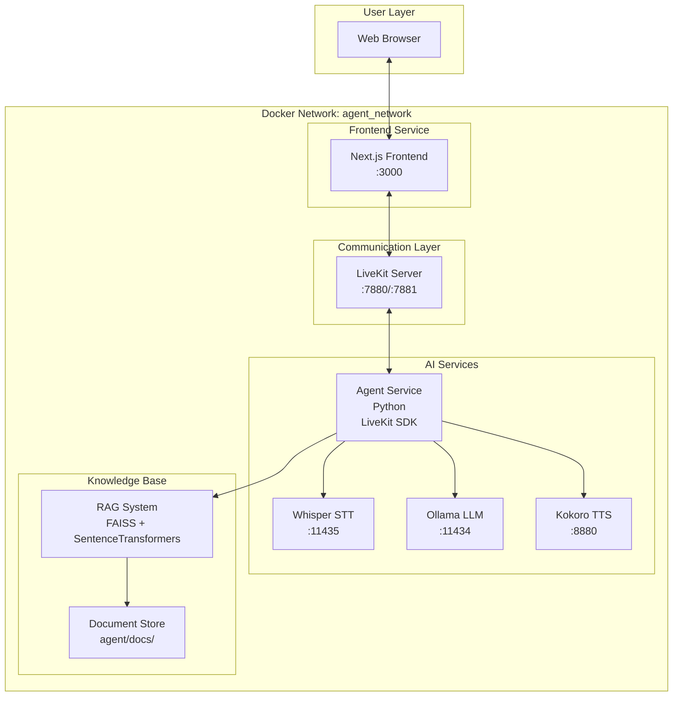
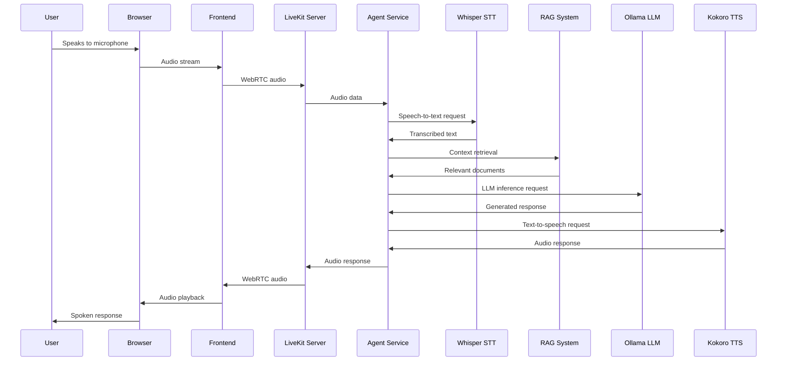
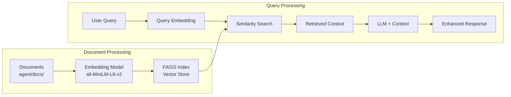

# System Architecture

This document provides a comprehensive overview of the Local Voice AI system architecture, component interactions, and data flows.

## 🏗️ High-Level Architecture

The Local Voice AI system is a microservices-based architecture where each component runs in its own Docker container and communicates over a shared Docker network.



## 🔄 Data Flow Sequence

### 1. User Speech Input Flow



### 2. RAG (Retrieval-Augmented Generation) Flow



## 📦 Component Details

### Frontend Service
- **Technology**: Next.js, React, Tailwind CSS
- **Port**: 3000
- **Purpose**: Web-based user interface for voice interactions
- **Key Features**:
  - Real-time audio visualization
  - Transcription display
  - WebRTC connection management
- **Dependencies**: LiveKit Server

### LiveKit Server
- **Technology**: Go-based WebRTC signaling
- **Ports**: 7880 (HTTP), 7881 (HTTPS)
- **Purpose**: WebRTC signaling and media routing
- **Key Features**:
  - Room management
  - Participant authentication
  - Media stream routing
- **Documentation**: [services/livekit.md](services/livekit.md)

### Agent Service
- **Technology**: Python with LiveKit Agents SDK
- **Purpose**: Central orchestration of AI services
- **Key Components**:
  - Voice activity detection (Silero VAD)
  - Service coordination
  - Metrics collection
  - RAG integration
- **Documentation**: [services/agent.md](services/agent.md)

### Whisper STT Service
- **Technology**: vox-box with Whisper model
- **Port**: 11435
- **Purpose**: Speech-to-text conversion
- **Model**: Systran/faster-whisper-small
- **Documentation**: [services/whisper.md](services/whisper.md)

### Ollama LLM Service
- **Technology**: Ollama with Gemma3:4b model
- **Port**: 11434
- **Purpose**: Language model inference
- **Memory**: 6-8GB allocated
- **Documentation**: [services/ollama.md](services/ollama.md)

### Kokoro TTS Service
- **Technology**: Kokoro FastAPI
- **Port**: 8880
- **Purpose**: Text-to-speech synthesis
- **Voice**: af_nova
- **Documentation**: [services/kokoro.md](services/kokoro.md)

## 🔗 Network Configuration

### Docker Network
All services communicate over the `agent_network` bridge network:

```yaml
networks:
  agent_network:
    driver: bridge
```

### Service Communication
- **Internal URLs**: Services use container names for internal communication
- **External Access**: Only necessary ports are exposed to the host
- **Authentication**: LiveKit uses API keys for secure connections

### Port Mapping
| Service | Internal Port | External Port | Purpose |
|---------|---------------|---------------|---------|
| Frontend | 3000 | 3000 | Web UI access |
| LiveKit | 7880 | 7880 | WebRTC signaling |
| LiveKit | 7881 | 7881 | WebRTC signaling (TLS) |
| Whisper | 80 | 11435 | STT API |
| Ollama | 11434 | 11434 | LLM API |
| Kokoro | 8880 | 8880 | TTS API |

## 🗂️ Data Storage

### Persistent Volumes
- **ollama**: Stores downloaded models
- **whisper-data**: Caches model files and data

### Document Store
- **Location**: `agent/docs/`
- **Format**: Plain text files
- **Purpose**: Knowledge base for RAG system
- **Processing**: Automatically embedded on agent startup

## 🔐 Security Considerations

### Authentication
- **LiveKit**: API key and secret for room access
- **Tokens**: JWT-based participant tokens (15-minute TTL)
- **Environment**: Development keys for local deployment

### Network Security
- **Isolation**: Services communicate within Docker network
- **Minimal Exposure**: Only necessary ports exposed
- **No External Dependencies**: All AI services run locally

## ⚡ Performance Characteristics

### Latency Optimization
- **Local Processing**: All AI services run locally to minimize latency
- **Streaming**: Real-time audio streaming for responsive interaction
- **Caching**: Models cached in memory for faster inference

### Resource Requirements
- **Memory**: Minimum 12GB recommended
- **CPU**: Multi-core processor for concurrent model inference
- **Storage**: 10GB+ for models and data

## 🔄 Service Dependencies

### Startup Order
1. **LiveKit Server** (signaling infrastructure)
2. **AI Services** (Whisper, Ollama, Kokoro)
3. **Agent Service** (orchestration)
4. **Frontend** (user interface)

### Health Checks
- Services monitor each other's availability
- Automatic reconnection on service restart
- Graceful degradation when services are unavailable

## 🚀 Scaling Considerations

### Current Limitations
- Single-agent architecture
- Local deployment only
- Shared resources between services

### Potential Enhancements
- Multi-agent support
- Horizontal scaling of AI services
- Cloud deployment options
- Load balancing for high availability

## 📊 Monitoring and Metrics

### Collected Metrics
- **LLM Metrics**: Token usage, response time, TTFT (Time to First Token)
- **STT Metrics**: Audio duration, transcription time, accuracy
- **TTS Metrics**: Generation time, audio duration, TTFB (Time to First Byte)
- **VAD Metrics**: Voice activity detection events

### Logging
- Structured JSON logging for all services
- Performance metrics for debugging
- Error tracking and reporting

---

*For implementation details of specific services, see the service-specific documentation in the [services/](services/index.md) directory.*