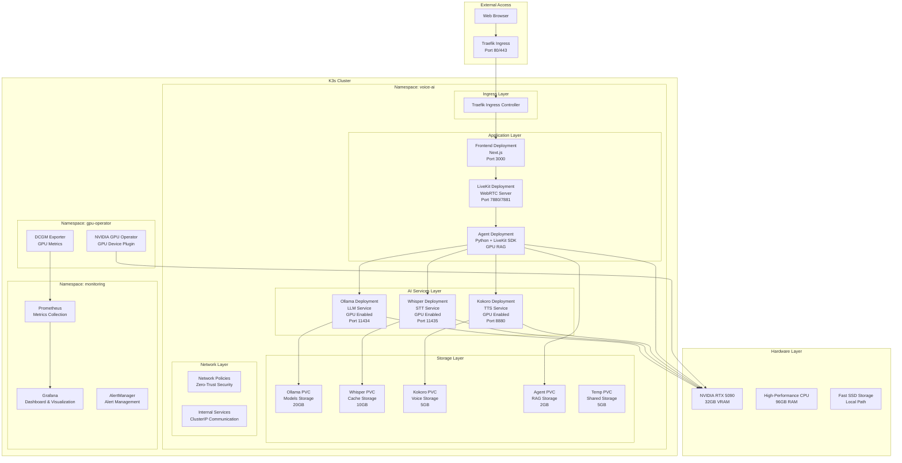

# Kubernetes Architecture for Local Voice AI

## Overview

This document describes the Kubernetes architecture for Local Voice AI, which replaces the previous Docker-based deployment with a more robust, scalable, and production-ready solution optimized for GPU acceleration.

## Architecture Diagram

## Key Components

### 1. K3s Kubernetes Cluster

**K3s** is a lightweight, certified Kubernetes distribution perfect for edge computing, IoT, and CI/CD. It's chosen for:

- **Minimal Resource Usage**: Single binary < 100MB
- **Fast Startup**: Ready in minutes
- **Production Ready**: Full Kubernetes API compatibility
- **GPU Support**: Native NVIDIA GPU integration

### 2. GPU Integration

The architecture is optimized for NVIDIA RTX 5090 with 32GB VRAM:

- **NVIDIA GPU Operator**: Manages GPU device plugins and drivers
- **CUDA Runtime**: Direct GPU access for containers
- **MPS (Multi-Process Service)**: Efficient GPU sharing between services
- **GPU Time-Slicing**: Logical division of GPU resources

### 3. Service Architecture

#### Frontend Service
- **Technology**: Next.js with React
- **Purpose**: Web interface for voice interaction
- **Resources**: 1-2 CPU cores, 2-4GB RAM
- **GPU**: Not required

#### LiveKit Service
- **Technology**: WebRTC signaling server
- **Purpose**: Real-time audio/video communication
- **Resources**: 1-2 CPU cores, 1-2GB RAM
- **GPU**: Not required

#### Agent Service
- **Technology**: Python with LiveKit SDK
- **Purpose**: Orchestrates AI services and RAG
- **Resources**: 2-4 CPU cores, 8-12GB RAM
- **GPU**: 3GB VRAM for embeddings and FAISS

#### Ollama Service
- **Technology**: Ollama LLM inference server
- **Purpose**: Large language model inference
- **Resources**: 4-8 CPU cores, 16-24GB RAM
- **GPU**: 12GB VRAM for model acceleration

#### Whisper Service
- **Technology**: OpenAI Whisper with CUDA
- **Purpose**: Speech-to-text transcription
- **Resources**: 2-4 CPU cores, 4-8GB RAM
- **GPU**: 4GB VRAM for audio processing

#### Kokoro Service
- **Technology**: Neural TTS with CUDA
- **Purpose**: Text-to-speech synthesis
- **Resources**: 2-4 CPU cores, 4-8GB RAM
- **GPU**: 3GB VRAM for voice synthesis

### 4. Storage Architecture

#### Persistent Storage
- **Ollama Models**: 20GB for LLM models
- **Whisper Cache**: 10GB for audio processing cache
- **Kokoro Voices**: 5GB for TTS models
- **Agent RAG**: 2GB for document embeddings
- **Temporary**: 5GB for shared temporary files

#### Storage Classes
- **local-path**: Standard storage for general use
- **local-path-ssd**: High-performance storage for AI models

### 5. Network Architecture

#### Zero-Trust Security
- **Default Deny**: All traffic denied by default
- **Service-Specific Rules**: Only allowed communication paths
- **Namespace Isolation**: Separate network policies per namespace

#### Service Communication
- **Internal Services**: ClusterIP for internal communication
- **External Access**: Traefik ingress for external traffic
- **Service Discovery**: Kubernetes DNS for service resolution

### 6. Monitoring and Observability

#### Metrics Collection
- **Prometheus**: Collects metrics from all services
- **DCGM Exporter**: Specialized GPU metrics
- **Node Exporter**: System resource metrics

#### Visualization
- **Grafana**: Dashboards for system and GPU metrics
- **Custom Dashboards**: Service-specific monitoring

#### Alerting
- **AlertManager**: Manages alerts and notifications
- **Custom Rules**: Service health and GPU utilization alerts

## Deployment Modes

### 1. GPU-Optimized Mode

**Primary deployment mode** for maximum performance:

- **GPU Acceleration**: All AI services use GPU
- **Resource Allocation**: Optimized for RTX 5090
- **Performance**: 10-50x faster inference
- **Use Case**: Production and high-performance environments

### 2. CPU Fallback Mode

**Automatic fallback** when GPU is unavailable:

- **CPU Processing**: All services run on CPU
- **Resource Allocation**: Higher CPU and memory allocation
- **Performance**: Baseline CPU performance
- **Use Case**: Development, testing, and GPU failure recovery

### 3. Hybrid Mode

**Manual selection** between GPU and CPU:

- **Selective GPU**: Choose which services use GPU
- **Resource Management**: Balanced allocation
- **Flexibility**: Adapt to different hardware configurations
- **Use Case**: Systems with limited GPU resources

## Security Architecture

### 1. Network Security

- **Zero-Trust**: Default deny all traffic
- **Service Segmentation**: Isolated network policies
- **Ingress Control**: Traefik with security headers
- **Egress Filtering**: Controlled outbound connections

### 2. Pod Security

- **Non-Root Users**: All containers run as non-root
- **Read-Only Filesystems**: Minimize attack surface
- **Security Contexts**: Pod and container-level security
- **Seccomp Profiles**: System call filtering

### 3. RBAC

- **Service Accounts**: Per-service identities
- **Minimal Permissions**: Least privilege principle
- **Role Bindings**: Controlled access to resources

## Resource Allocation

### GPU Memory Allocation

| Service | GPU Memory | Purpose |
|---------|------------|---------|
| Ollama | 12GB | LLM model inference |
| Whisper | 4GB | Audio processing |
| Kokoro | 3GB | Voice synthesis |
| Agent | 3GB | Embeddings and RAG |
| System | 10GB | Overhead and stability |

### CPU and Memory Allocation

| Service | CPU Request | CPU Limit | Memory Request | Memory Limit |
|---------|-------------|-----------|----------------|--------------|
| Frontend | 1000m | 2000m | 2Gi | 4Gi |
| Agent | 2000m | 4000m | 8Gi | 12Gi |
| LiveKit | 1000m | 2000m | 1Gi | 2Gi |
| Whisper | 2000m | 4000m | 4Gi | 8Gi |
| Kokoro | 2000m | 4000m | 4Gi | 8Gi |
| Ollama | 4000m | 8000m | 16Gi | 24Gi |

## Performance Optimization

### 1. GPU Optimization

- **CUDA Runtime**: Direct GPU access
- **Memory Management**: Efficient VRAM usage
- **Batch Processing**: Optimized inference batches
- **Model Caching**: Pre-loaded models

### 2. CPU Optimization

- **Multi-Threading**: Parallel processing
- **Memory Management**: Optimized memory usage
- **Caching**: Intelligent caching strategies
- **Load Balancing**: Even resource distribution

### 3. Network Optimization

- **Service Mesh**: Efficient service communication
- **Connection Pooling**: Reuse network connections
- **Compression**: Reduce network overhead
- **Caching**: Edge caching for static content

## High Availability and Resilience

### 1. Auto-Healing

- **Health Checks**: Comprehensive health monitoring
- **Auto-Restart**: Automatic service recovery
- **Rolling Updates**: Zero-downtime deployments
- **Pod Disruption Budgets**: Ensure service availability

### 2. Fallback Mechanisms

- **GPU to CPU**: Automatic fallback on GPU failure
- **Service Redundancy**: Multiple service instances
- **Circuit Breakers**: Prevent cascade failures
- **Graceful Degradation**: Maintain core functionality

### 3. Backup and Recovery

- **Persistent Storage**: Data persistence across restarts
- **Volume Snapshots**: Point-in-time backups
- **Configuration Backup**: Version-controlled configs
- **Disaster Recovery**: Recovery procedures

## Scaling Considerations

### 1. Horizontal Scaling

- **Pod Autoscaling**: Automatic scaling based on load
- **Resource Limits**: Controlled resource usage
- **Load Balancing**: Even traffic distribution
- **Performance Monitoring**: Real-time metrics

### 2. Vertical Scaling

- **Resource Allocation**: Dynamic resource adjustment
- **GPU Scaling**: Multiple GPU support
- **Memory Scaling**: On-demand memory allocation
- **Storage Scaling**: Expandable storage solutions

## Development Workflow

### 1. Local Development

- **K3s Cluster**: Local Kubernetes environment
- **GPU Support**: Development GPU acceleration
- **Hot Reload**: Rapid development iteration
- **Debugging**: Integrated debugging tools

### 2. CI/CD Integration

- **Automated Testing**: Comprehensive test suites
- **Image Building**: Automated container builds
- **Deployment Pipelines**: Automated deployments
- **Rollback Capabilities**: Quick recovery from failures

### 3. Monitoring and Debugging

- **Real-time Logs**: Centralized log collection
- **Performance Metrics**: Detailed performance data
- **Error Tracking**: Comprehensive error monitoring
- **Debugging Tools**: Integrated debugging capabilities

## Migration from Docker

### 1. Benefits

- **Resource Management**: Better resource utilization
- **Scalability**: Easy horizontal scaling
- **Monitoring**: Built-in observability
- **Security**: Enhanced security features
- **Production Ready**: Enterprise-grade features

### 2. Migration Strategy

- **Parallel Deployment**: Run both systems during transition
- **Gradual Migration**: Service-by-service migration
- **Testing**: Comprehensive testing at each stage
- **Rollback Plan**: Quick rollback if needed

### 3. Compatibility

- **Configuration**: Equivalent configuration management
- **Data Migration**: Seamless data transfer
- **API Compatibility**: Maintained API interfaces
- **User Experience**: Consistent user experience

## Future Enhancements

### 1. Multi-GPU Support

- **GPU Clustering**: Multiple GPU systems
- **Load Balancing**: GPU workload distribution
- **Resource Sharing**: Efficient GPU utilization
- **Performance Scaling**: Linear performance improvement

### 2. Cloud Integration

- **Hybrid Cloud**: On-premises and cloud integration
- **Cloud Bursting**: Scale to cloud on demand
- **Disaster Recovery**: Cloud-based recovery
- **Global Deployment**: Multi-region deployment

### 3. Advanced AI Features

- **Model Optimization**: Advanced model tuning
- **Custom Models**: Organization-specific models
- **Federated Learning**: Distributed model training
- **Edge AI**: Local AI processing

## Conclusion

The Kubernetes architecture for Local Voice AI provides a robust, scalable, and production-ready solution that maximizes the performance of your RTX 5090 while maintaining flexibility and reliability. The GPU-optimized design delivers exceptional performance for AI workloads, while the CPU fallback ensures continuous operation even when GPU resources are unavailable.

This architecture represents a significant improvement over the previous Docker-based deployment, offering better resource management, enhanced security, comprehensive monitoring, and seamless scalability for future growth.