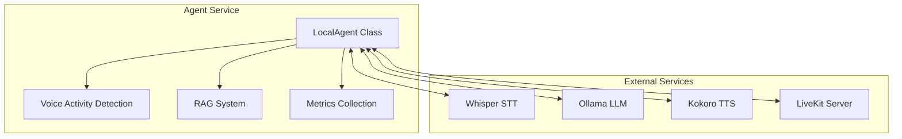

# Agent Service Documentation

This document provides comprehensive documentation for the Agent service, which is the central orchestration component of the Local Voice AI system.

## 📋 Overview

The Agent service is a Python-based application that coordinates all AI services in the system. It handles real-time audio processing, manages service communication, and implements the core voice assistant logic using the LiveKit Agents SDK.

**Location**: [`agent/myagent.py`](../../agent/myagent.py)
**Technology Stack**: Python 3.12, LiveKit Agents SDK, asyncio  
**Container**: `agent`  
**Dependencies**: Whisper STT, Ollama LLM, Kokoro TTS, LiveKit Server

## 🏗️ Architecture

### Core Components



### Class Structure

```python
class LocalAgent(Agent):
    """
    Main agent class that orchestrates all AI services.
    
    This class extends the LiveKit Agent base class and implements
    the core voice assistant functionality including speech-to-text,
    language model inference, and text-to-speech synthesis.
    """
```

## 🔧 Configuration

### Environment Variables

| Variable | Default | Description |
|----------|---------|-------------|
| `LIVEKIT_HOST` | `ws://livekit:7880` | LiveKit server WebSocket URL |
| `LIVEKIT_API_KEY` | `devkey` | LiveKit API key for authentication |
| `LIVEKIT_API_SECRET` | `secret` | LiveKit API secret for authentication |
| `LIVEKIT_AGENT_PORT` | `7880` | LiveKit server port |
| `OPENAI_API_KEY` | `no-key-needed` | API key for OpenAI-compatible services |
| `GROQ_API_KEY` | `no-key-needed` | API key for Groq-compatible services |

### Docker Configuration

```dockerfile
# agent/Dockerfile
FROM python:3.12-slim-bookworm
WORKDIR /home/appuser
COPY requirements.txt .
RUN pip install --user --no-cache-dir -r requirements.txt
COPY . .
ENTRYPOINT ["python", "myagent.py"]
CMD ["start"]
```

### Dependencies

```txt
# agent/requirements.txt
livekit
livekit-api
livekit-agents
livekit-plugins-openai
livekit-plugins-groq
livekit-plugins-silero
python-dotenv>=0.19.0
requests>=2.26.0
sentence-transformers
faiss-cpu
```

## 🔄 Service Integration

### Whisper STT Integration

```python
stt = openai.STT(
    base_url="http://whisper:80/v1",
    model="Systran/faster-whisper-small"
)
```

**See Also**: [docs/services/whisper.md](whisper.md)

### Ollama LLM Integration

```python
llm = openai.LLM(
    base_url="http://ollama:11434/v1",
    model="gemma3:4b",
    timeout=30
)
```

**See Also**: [docs/services/ollama.md](ollama.md)

### Kokoro TTS Integration

```python
tts = groq.TTS(
    base_url="http://kokoro:8880/v1",
    model="kokoro",
    voice="af_nova"
)
```

**See Also**: [docs/services/kokoro.md](kokoro.md)

### Voice Activity Detection

```python
vad_inst = silero.VAD.load()
```

## 🧠 RAG System Implementation

### Document Processing

```python
# Load documents from agent/docs/ directory
docs_dir = os.path.join(os.path.dirname(__file__), "docs")
if os.path.exists(docs_dir):
    for fn in os.listdir(docs_dir):
        with open(os.path.join(docs_dir, fn), encoding="utf-8") as f:
            docs.append(f.read())
```

### Embedding and Indexing

```python
# Load embedding model
embed_model = SentenceTransformer("all-MiniLM-L6-v2")

# Create FAISS index
if docs:
    embs = embed_model.encode(docs, show_progress_bar=False)
    dim = embs.shape[1]
    index = faiss.IndexFlatL2(dim)
    index.add(embs)
```

### RAG Lookup Function

```python
async def rag_lookup(query: str) -> str:
    """
    Perform RAG lookup for a given query.
    
    This function implements the retrieval process described in:
    docs/architecture.md#rag-retrieval-augmented-generation-flow
    
    Args:
        query: User query string to search for relevant documents.
    
    Returns:
        Concatenated relevant document snippets or empty string if no matches.
    """
    loop = asyncio.get_running_loop()
    
    q_emb = await loop.run_in_executor(None, lambda: embed_model.encode([query]))
    D, I = await loop.run_in_executor(None, lambda: index.search(q_emb, min(3, index.ntotal)))
    
    ctx = ""
    if index.ntotal > 0:
        ctx = "\n\n---\n\n".join(docs[i] for i in I[0])
    
    return ctx
```

## 📊 Metrics Collection

### LLM Metrics

```python
async def on_llm_metrics_collected(self, metrics):
    """
    Collect and log LLM performance metrics.
    
    Metrics include:
    - Response time and duration
    - Token usage (prompt, completion, total)
    - Time to first token (TTFT)
    - Cancellation status
    """
    logger.info(f"LLM Metrics: {{" +
        f"'type': {metrics.type}, " +
        f"'label': {metrics.label}, " +
        f"'request_id': {metrics.request_id}, " +
        f"'duration': {metrics.duration}, " +
        f"'ttft': {getattr(metrics, 'ttft', None)}, " +
        f"'completion_tokens': {getattr(metrics, 'completion_tokens', None)}, " +
        f"'prompt_tokens': {getattr(metrics, 'prompt_tokens', None)}, " +
        f"'total_tokens': {getattr(metrics, 'total_tokens', None)}, " +
        f"'tokens_per_second': {getattr(metrics, 'tokens_per_second', None)}" +
        "}")
```

### STT Metrics

```python
async def on_stt_metrics_collected(self, metrics):
    """
    Collect and log speech-to-text performance metrics.
    
    Metrics include:
    - Transcription duration
    - Audio duration
    - Error information
    - Streaming status
    """
    logger.info(f"STT Metrics: {{" +
        f"'type': {metrics.type}, " +
        f"'duration': {metrics.duration}, " +
        f"'audio_duration': {getattr(metrics, 'audio_duration', None)}, " +
        f"'error': {str(getattr(metrics, 'error', None)) if getattr(metrics, 'error', None) else None}, " +
        f"'streamed': {getattr(metrics, 'streamed', None)}" +
        "}")
```

### TTS Metrics

```python
async def on_tts_metrics_collected(self, metrics):
    """
    Collect and log text-to-speech performance metrics.
    
    Metrics include:
    - Generation duration
    - Time to first byte (TTFB)
    - Audio duration
    - Character count
    - Cancellation status
    """
    logger.info(f"TTS Metrics: {{" +
        f"'type': {metrics.type}, " +
        f"'duration': {metrics.duration}, " +
        f"'ttfb': {getattr(metrics, 'ttfb', None)}, " +
        f"'audio_duration': {getattr(metrics, 'audio_duration', None)}, " +
        f"'characters_count': {getattr(metrics, 'characters_count', None)}, " +
        f"'cancelled': {getattr(metrics, 'cancelled', None)}" +
        "}")
```

## 🔄 Event Handling

### User Turn Processing

```python
async def on_user_turn_completed(
    self, turn_ctx: ChatContext, new_message: ChatMessage,
) -> None:
    """
    Process completed user turn with RAG enhancement.
    
    This method is called when the user finishes speaking and the
    transcription is complete. It retrieves relevant context using
    RAG and adds it to the chat context before LLM processing.
    
    Args:
        turn_ctx: Chat context containing conversation history.
        new_message: The newly transcribed user message.
    """
    rag_content = await rag_lookup(new_message.text_content)
    if rag_content:
        turn_ctx.add_message(
            role="user",
            content=f"Additional information relevant to the user's next message: {rag_content}"
        )
        logger.info(f"Added RAG content to chat context: {rag_content}")
```

## 🚀 Deployment and Operations

### Starting the Agent

```bash
# Using Docker Compose
docker-compose up agent

# Manual start
cd agent
python myagent.py start
```

### Health Monitoring

```bash
# Check agent logs
docker-compose logs -f agent

# Check container status
docker-compose ps agent

# Execute commands in container
docker-compose exec agent bash
```

### Debugging

```python
# Enable debug logging
import logging
logging.getLogger("local-agent").setLevel(logging.DEBUG)

# Check service connectivity
docker-compose exec agent ping whisper
docker-compose exec agent ping ollama
docker-compose exec agent ping kokoro
```

## 🔧 Development Guidelines

### For Coding Agents

When modifying the agent service:

1. **Follow docstring standards**: See [docs/coding-standards.md](../coding-standards.md)
2. **Update service documentation**: Keep this file in sync with code changes
3. **Test service integration**: Verify all external service connections
4. **Update metrics collection**: Add new metrics for new functionality
5. **Handle errors gracefully**: Implement proper error handling for all service calls

### Adding New AI Services

```python
class LocalAgent(Agent):
    def __init__(self) -> None:
        # Existing service initialization
        stt = openai.STT(...)
        llm = openai.LLM(...)
        tts = groq.TTS(...)
        
        # Add new service
        new_service = NewService(base_url="http://new-service:8080")
        
        # Configure metrics
        new_service.on("metrics_collected", new_service_metrics_wrapper)
        
        super().__init__(
            stt=stt,
            llm=llm,
            tts=tts,
            # Add new service to agent configuration
        )
```

### Modifying RAG System

```python
# When changing embedding models
embed_model = SentenceTransformer("new-model-name")

# When changing document processing
def load_documents_custom():
    """Custom document loading logic."""
    # Implementation
    pass
```

## 🚨 Troubleshooting

### Common Issues

#### Service Connection Failures
```bash
# Check if services are reachable
docker-compose exec agent curl http://whisper:80/v1/models
docker-compose exec agent curl http://ollama:11434/api/tags
docker-compose exec agent curl http://kokoro:8880/v1/models
```

#### Memory Issues
```bash
# Check memory usage
docker stats agent

# Monitor RAG system memory
docker-compose exec agent python -c "import faiss; print(f'Index size: {index.ntotal}')"
```

#### Audio Processing Issues
```bash
# Check audio format compatibility
# Verify sample rates and encoding formats
# Check VAD configuration
```

### Debug Mode

```python
# Enable debug logging
logger.setLevel(logging.DEBUG)

# Add debug endpoints
async def debug_agent_state():
    """Return current agent state for debugging."""
    return {
        "rag_index_size": index.ntotal if 'index' in globals() else 0,
        "loaded_docs": len(docs) if 'docs' in globals() else 0,
        "service_status": await check_all_services()
    }
```

## 📈 Performance Optimization

### Async Optimization

```python
# Use asyncio.gather for concurrent operations
async def process_concurrently(audio_data, text):
    """Process audio and text concurrently."""
    audio_task = asyncio.create_task(process_audio(audio_data))
    text_task = asyncio.create_task(process_text(text))
    
    return await asyncio.gather(audio_task, text_task)
```

### Caching

```python
from functools import lru_cache

@lru_cache(maxsize=100)
def get_embedding_cached(text: str):
    """Cache embeddings to avoid recomputation."""
    return embed_model.encode([text])[0]
```

## 🔗 API Reference

### Core Methods

| Method | Description | Parameters | Returns |
|--------|-------------|------------|---------|
| `on_user_turn_completed()` | Process user input with RAG | `turn_ctx`, `new_message` | `None` |
| `on_llm_metrics_collected()` | Handle LLM metrics | `metrics` | `None` |
| `on_stt_metrics_collected()` | Handle STT metrics | `metrics` | `None` |
| `on_tts_metrics_collected()` | Handle TTS metrics | `metrics` | `None` |
| `rag_lookup()` | Retrieve relevant documents | `query: str` | `str` |

### Configuration

| Property | Type | Default | Description |
|----------|------|---------|-------------|
| `stt` | `openai.STT` | - | Speech-to-text service |
| `llm` | `openai.LLM` | - | Language model service |
| `tts` | `groq.TTS` | - | Text-to-speech service |
| `vad` | `silero.VAD` | - | Voice activity detection |

---

*For system-wide architecture information, see [docs/architecture.md](../architecture.md). For development guidelines, see [docs/development-workflow.md](../development-workflow.md).*