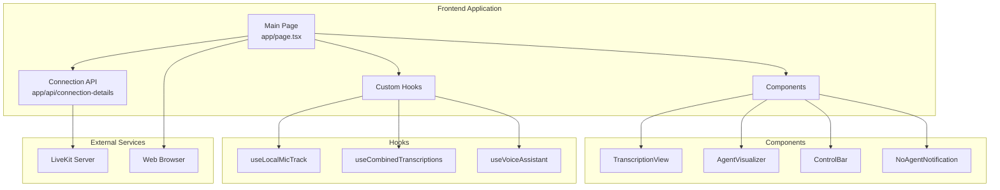

# Frontend Service Documentation

This document provides comprehensive documentation for the Frontend service, which provides the web-based user interface for the Local Voice AI system.

## 📋 Overview

The Frontend service is a Next.js React application that provides the web interface for users to interact with the voice assistant. It handles audio capture, real-time communication with LiveKit, and displays transcriptions and visual feedback.

**Technology**: Next.js 14, React 18, TypeScript, Tailwind CSS  
**Container**: `frontend`  
**Port**: 3000  
**Build Tool**: pnpm  
**UI Framework**: Tailwind CSS with LiveKit components

## 🏗️ Architecture

### Component Structure



### Docker Configuration

```dockerfile
# voice-assistant-frontend/Dockerfile
FROM node:18-alpine AS base

# Install dependencies only when needed
FROM base AS deps
RUN apk add --no-cache libc6-compat
WORKDIR /app

COPY package.json pnpm-lock.yaml* ./
RUN corepack enable pnpm && pnpm i --frozen-lockfile

# Rebuild the source code only when needed
FROM base AS builder
WORKDIR /app
COPY --from=deps /app/node_modules ./node_modules
COPY . .

RUN npm run build

# Production image, copy all the files and run next
FROM base AS runner
WORKDIR /app

ENV NODE_ENV production

RUN addgroup --system --gid 1001 nodejs
RUN adduser --system --uid 1001 nextjs

COPY --from=builder /app/public ./public

RUN mkdir .next
RUN chown nextjs:nodejs .next

COPY --from=builder --chown=nextjs:nodejs /app/.next/standalone ./
COPY --from=builder --chown=nextjs:nodejs /app/.next/static ./.next/static

USER nextjs

EXPOSE 3000

ENV PORT 3000
ENV HOSTNAME "0.0.0.0"

CMD ["node", "server.js"]
```

### Docker Compose Configuration

```yaml
# docker-compose.yml
frontend:
  build:
    context: ./voice-assistant-frontend
  ports:
    - "3000:3000"
  environment:
    - NEXT_PUBLIC_LIVEKIT_URL=ws://localhost:7880
    - LIVEKIT_URL=ws://livekit:7880
    - LIVEKIT_API_KEY=devkey
    - LIVEKIT_API_SECRET=secret
    - NEXT_PUBLIC_LIVEKIT_API_KEY=devkey
  depends_on:
    - livekit
  networks:
    - agent_network
```

## 🔧 Configuration

### Environment Variables

| Variable | Default | Description |
|----------|---------|-------------|
| `NEXT_PUBLIC_LIVEKIT_URL` | `ws://localhost:7880` | Public LiveKit URL for client connections |
| `LIVEKIT_URL` | `ws://livekit:7880` | Internal LiveKit URL for server-side calls |
| `LIVEKIT_API_KEY` | `devkey` | LiveKit API key |
| `LIVEKIT_API_SECRET` | `secret` | LiveKit API secret |
| `NEXT_PUBLIC_LIVEKIT_API_KEY` | `devkey` | Public LiveKit API key |
| `NODE_ENV` | `production` | Node environment (development/production) |
| `PORT` | `3000` | Frontend server port |

### Package Dependencies

```json
{
  "dependencies": {
    "@livekit/components-react": "^2.9.3",
    "@livekit/components-styles": "^1.1.4",
    "framer-motion": "^11.18.0",
    "livekit-client": "^2.8.0",
    "livekit-server-sdk": "^2.9.7",
    "react": "^18.3.1",
    "react-dom": "^18.3.1"
  },
  "devDependencies": {
    "@trivago/prettier-plugin-sort-imports": "^5.2.2",
    "@types/node": "^20.17.13",
    "@types/react": "^18.3.18",
    "@types/react-dom": "^18.3.5",
    "eslint": "^8.57.1",
    "eslint-config-next": "14.2.28",
    "eslint-config-prettier": "9.1.0",
    "next": "14",
    "postcss": "^8.5.1",
    "prettier": "^3.4.2",
    "tailwindcss": "^3.4.17",
    "typescript": "^5.7.3"
  }
}
```

## 🔄 API Reference

### Connection Details API

#### GET /api/connection-details

Generates connection details for LiveKit room connection.

**Response**:
```typescript
export type ConnectionDetails = {
  serverUrl: string;
  roomName: string;
  participantName: string;
  participantToken: string;
};
```

**Implementation**:
```typescript
// app/api/connection-details/route.ts
export async function GET(): Promise<NextResponse> {
  try {
    if (LIVEKIT_URL === undefined) {
      throw new Error("NEXT_PUBLIC_LIVEKIT_URL is not defined");
    }
    if (API_KEY === undefined) {
      throw new Error("LIVEKIT_API_KEY is not defined");
    }
    if (API_SECRET === undefined) {
      throw new Error("LIVEKIT_API_SECRET is not defined");
    }

    // Generate participant token
    const participantIdentity = `voice_assistant_user_${Math.floor(Math.random() * 10_000)}`;
    const roomName = `voice_assistant_room_${Math.floor(Math.random() * 10_000)}`;
    const participantToken = await createParticipantToken(
      { identity: participantIdentity },
      roomName
    );

    // Return connection details
    const data: ConnectionDetails = {
      serverUrl: LIVEKIT_URL,
      roomName,
      participantToken,
      participantName: participantIdentity,
    };

    return NextResponse.json(data);
  } catch (error) {
    if (error instanceof Error) {
      console.error(error);
      return new NextResponse(error.message, { status: 500 });
    }
  }
}
```

## 🔗 Component Documentation

### Main Page Component

```typescript
// app/page.tsx
export default function Page() {
  const [room] = useState(new Room());

  const onConnectButtonClicked = useCallback(async () => {
    // Get connection details from API
    const response = await fetch("/api/connection-details");
    const connectionDetailsData: ConnectionDetails = await response.json();

    // Connect to LiveKit room
    await room.connect(
      connectionDetailsData.serverUrl, 
      connectionDetailsData.participantToken
    );
    
    // Enable microphone
    await room.localParticipant.setMicrophoneEnabled(true);
  }, [room]);

  return (
    <main data-lk-theme="default" className="h-full grid content-center bg-[var(--lk-bg)]">
      <RoomContext.Provider value={room}>
        <div className="lk-room-container max-w-[1024px] w-[90vw] mx-auto max-h-[90vh]">
          <SimpleVoiceAssistant onConnectButtonClicked={onConnectButtonClicked} />
        </div>
      </RoomContext.Provider>
    </main>
  );
}
```

### Transcription View Component

```typescript
// components/TranscriptionView.tsx
export default function TranscriptionView() {
  const combinedTranscriptions = useCombinedTranscriptions();
  const containerRef = React.useRef<HTMLDivElement>(null);

  // Auto-scroll to bottom when new transcription is added
  React.useEffect(() => {
    if (containerRef.current) {
      containerRef.current.scrollTop = containerRef.current.scrollHeight;
    }
  }, [combinedTranscriptions]);

  return (
    <div className="relative h-[200px] w-[512px] max-w-[90vw] mx-auto">
      {/* Fade-out gradient mask */}
      <div className="absolute top-0 left-0 right-0 h-8 bg-gradient-to-b from-[var(--lk-bg)] to-transparent z-10 pointer-events-none" />
      <div className="absolute bottom-0 left-0 right-0 h-8 bg-gradient-to-t from-[var(--lk-bg)] to-transparent z-10 pointer-events-none" />

      {/* Scrollable content */}
      <div ref={containerRef} className="h-full flex flex-col gap-2 overflow-y-auto px-4 py-8">
        {combinedTranscriptions.map((segment) => (
          <div
            key={segment.id}
            className={
              segment.role === "assistant"
                ? "p-2 self-start fit-content"
                : "bg-gray-800 rounded-md p-2 self-end fit-content"
            }
          >
            {segment.text}
          </div>
        ))}
      </div>
    </div>
  );
}
```

### Agent Visualizer Component

```typescript
function AgentVisualizer() {
  const { state: agentState, videoTrack, audioTrack } = useVoiceAssistant();

  if (videoTrack) {
    return (
      <div className="h-[512px] w-[512px] rounded-lg overflow-hidden">
        <VideoTrack trackRef={videoTrack} />
      </div>
    );
  }
  
  return (
    <div className="h-[300px] w-full">
      <BarVisualizer
        state={agentState}
        barCount={5}
        trackRef={audioTrack}
        className="agent-visualizer"
        options={{ minHeight: 24 }}
      />
    </div>
  );
}
```

## 🔗 Hook Documentation

### useCombinedTranscriptions Hook

```typescript
// hooks/useCombinedTranscriptions.ts
export default function useCombinedTranscriptions() {
  const { state: agentState, transcriptions } = useVoiceAssistant();
  const [combinedTranscriptions, setCombinedTranscriptions] = useState<TranscriptionSegment[]>([]);

  useEffect(() => {
    const segments: TranscriptionSegment[] = [];
    
    // Add user transcriptions
    transcriptions.forEach((transcription) => {
      segments.push({
        id: `user-${transcription.id}`,
        text: transcription.text,
        role: "user",
        timestamp: new Date(),
      });
    });

    // Add agent responses (if available)
    if (agentState === "speaking") {
      // Add agent response logic here
    }

    setCombinedTranscriptions(segments);
  }, [transcriptions, agentState]);

  return combinedTranscriptions;
}
```

### useLocalMicTrack Hook

```typescript
// hooks/useLocalMicTrack.ts
export default function useLocalMicTrack() {
  const { microphoneTrack, localParticipant } = useLocalParticipant();

  const micTrackRef: TrackReferenceOrPlaceholder = useMemo(() => {
    return {
      participant: localParticipant,
      source: Track.Source.Microphone,
      publication: microphoneTrack,
    };
  }, [localParticipant, microphoneTrack]);

  return micTrackRef;
}
```

## 🚀 Deployment and Operations

### Development Setup

```bash
# Install dependencies
cd voice-assistant-frontend
pnpm install

# Start development server
pnpm dev

# Build for production
pnpm build

# Start production server
pnpm start
```

### Docker Deployment

```bash
# Build and run with Docker Compose
docker-compose up frontend

# Manual build and run
cd voice-assistant-frontend
docker build -t voice-assistant-frontend .
docker run -p 3000:3000 voice-assistant-frontend
```

### Service Health Monitoring

```bash
# Check service status
docker-compose ps frontend

# View logs
docker-compose logs -f frontend

# Health check
curl http://localhost:3000/

# Check API endpoint
curl http://localhost:3000/api/connection-details
```

## 🔧 Development Guidelines

### For Coding Agents

When working with the Frontend service:

1. **TypeScript**: Use strict TypeScript with proper type definitions
2. **Component Structure**: Follow React best practices with functional components
3. **State Management**: Use React hooks for state management
4. **Error Handling**: Implement proper error boundaries and loading states
5. **Accessibility**: Ensure components are accessible with proper ARIA labels

### Component Development

```typescript
/**
 * Component documentation following JSDoc standards.
 * 
 * This component handles the transcription display and manages
 * the real-time updates from the LiveKit connection.
 * 
 * @param props - Component props
 * @returns JSX element for the transcription view
 * 
 * @example
 * ```tsx
 * <TranscriptionView />
 * ```
 * 
 * @see docs/services/frontend.md for implementation details
 * @see docs/services/livekit.md for LiveKit integration
 */
interface TranscriptionViewProps {
  /** Maximum number of transcriptions to display */
  maxItems?: number;
  /** Custom CSS class name */
  className?: string;
}

export default function TranscriptionView({
  maxItems = 50,
  className = ""
}: TranscriptionViewProps) {
  // Component implementation
}
```

### Error Handling

```typescript
// Error boundary for component errors
class TranscriptionErrorBoundary extends React.Component<
  { children: React.ReactNode },
  { hasError: boolean }
> {
  constructor(props: { children: React.ReactNode }) {
    super(props);
    this.state = { hasError: false };
  }

  static getDerivedStateFromError(error: Error): { hasError: boolean } {
    return { hasError: true };
  }

  componentDidCatch(error: Error, errorInfo: React.ErrorInfo) {
    console.error("TranscriptionView error:", error, errorInfo);
  }

  render() {
    if (this.state.hasError) {
      return (
        <div className="p-4 bg-red-100 border border-red-400 rounded">
          <p className="text-red-700">Transcription display error</p>
        </div>
      );
    }

    return this.props.children;
  }
}
```

### Audio Permission Handling

```typescript
// Handle microphone permissions
async function requestMicrophonePermission(): Promise<boolean> {
  try {
    const stream = await navigator.mediaDevices.getUserMedia({
      audio: {
        echoCancellation: true,
        noiseSuppression: true,
        sampleRate: 16000,
      },
    });
    
    // Stop the stream immediately (we just needed permission)
    stream.getTracks().forEach(track => track.stop());
    
    return true;
  } catch (error) {
    console.error("Microphone permission denied:", error);
    return false;
  }
}

// Check permission status
async function checkMicrophonePermission(): Promise<PermissionState> {
  try {
    const permission = await navigator.permissions.query({
      name: "microphone" as PermissionName,
    });
    return permission.state;
  } catch (error) {
    console.error("Cannot check microphone permission:", error);
    return "prompt";
  }
}
```

## 🚨 Troubleshooting

### Common Issues

#### Connection Issues
```bash
# Check if frontend is running
curl http://localhost:3000/

# Check API endpoint
curl http://localhost:3000/api/connection-details

# Check LiveKit connectivity
curl -I http://localhost:7880/
```

#### Audio Permission Issues
```javascript
// Check microphone permissions in browser console
navigator.permissions.query({ name: 'microphone' }).then(console.log);

// Test audio capture
navigator.mediaDevices.getUserMedia({ audio: true })
  .then(stream => {
    console.log("Microphone access granted");
    stream.getTracks().forEach(track => track.stop());
  })
  .catch(error => console.error("Microphone access denied:", error));
```

#### Build Issues
```bash
# Clear Next.js cache
rm -rf .next

# Clear node modules and reinstall
rm -rf node_modules pnpm-lock.yaml
pnpm install

# Check TypeScript compilation
pnpm run type-check
```

### Debug Mode

```bash
# Enable debug logging
NEXT_PUBLIC_DEBUG=true pnpm dev

# Check build output
pnpm build --debug

# Analyze bundle size
pnpm analyze
```

## 📈 Performance Optimization

### Code Splitting

```typescript
// Dynamic imports for code splitting
const TranscriptionView = dynamic(() => import('@/components/TranscriptionView'), {
  loading: () => <div>Loading transcriptions...</div>,
  ssr: false,
});

const AgentVisualizer = dynamic(() => import('@/components/AgentVisualizer'), {
  loading: () => <div>Loading visualizer...</div>,
  ssr: false,
});
```

### Audio Optimization

```typescript
// Optimize audio settings for voice
const AUDIO_CONSTRAINTS: MediaStreamConstraints = {
  audio: {
    echoCancellation: true,
    noiseSuppression: true,
    autoGainControl: true,
    sampleRate: 16000,
    channelCount: 1,
  },
};

// Preload audio context
const audioContext = new (window.AudioContext || (window as any).webkitAudioContext)();
```

### Caching Strategy

```typescript
// Cache connection details
const connectionCache = new Map<string, ConnectionDetails>();

async function getCachedConnectionDetails(): Promise<ConnectionDetails> {
  const cacheKey = 'connection-details';
  
  if (connectionCache.has(cacheKey)) {
    const cached = connectionCache.get(cacheKey)!;
    // Check if token is still valid (not expired)
    if (isTokenValid(cached.participantToken)) {
      return cached;
    }
  }
  
  // Fetch new connection details
  const response = await fetch('/api/connection-details');
  const details = await response.json();
  
  // Cache the result
  connectionCache.set(cacheKey, details);
  
  return details;
}
```

## 🔍 Testing

### Unit Testing

```typescript
// __tests__/TranscriptionView.test.tsx
import { render, screen } from '@testing-library/react';
import TranscriptionView from '@/components/TranscriptionView';

describe('TranscriptionView', () => {
  it('renders transcription segments', () => {
    render(<TranscriptionView />);
    
    // Test component rendering
    expect(screen.getByTestId('transcription-container')).toBeInTheDocument();
  });
  
  it('handles empty transcriptions', () => {
    render(<TranscriptionView />);
    
    // Test empty state
    expect(screen.queryByText(/No transcriptions/)).not.toBeInTheDocument();
  });
});
```

### Integration Testing

```bash
# Test API endpoint
curl -f http://localhost:3000/api/connection-details || exit 1

# Test frontend build
pnpm build || exit 1

# Test production server
pnpm start &
sleep 5
curl -f http://localhost:3000/ || exit 1
pkill -f "next start"
```

### E2E Testing

```typescript
// e2e/voice-assistant.spec.ts
import { test, expect } from '@playwright/test';

test('voice assistant interaction', async ({ page }) => {
  await page.goto('http://localhost:3000');
  
  // Test connection button
  await page.click('[data-testid="connect-button"]');
  
  // Wait for connection
  await expect(page.locator('[data-testid="transcription-container"]')).toBeVisible();
  
  // Test microphone permission (mock)
  await page.context().grantPermissions(['microphone']);
});
```

## 📊 Monitoring and Metrics

### Performance Metrics

- **Page Load Time**: Time to fully load the application
- **Connection Latency**: Time to establish LiveKit connection
- **Audio Latency**: Time from audio capture to transmission
- **Error Rate**: Failed connections and API calls

### Logging

```typescript
// Configure logging for frontend monitoring
const logger = {
  info: (message: string, data?: any) => {
    console.log(`[INFO] ${message}`, data);
    // Send to monitoring service
  },
  
  error: (message: string, error?: Error) => {
    console.error(`[ERROR] ${message}`, error);
    // Send to error tracking service
  },
  
  performance: (metric: string, value: number) => {
    console.log(`[PERF] ${metric}: ${value}ms`);
    // Send to performance monitoring
  }
};

// Track performance metrics
export function trackConnectionLatency(startTime: number) {
  const duration = performance.now() - startTime;
  logger.performance('connection-latency', duration);
}
```

---

*For LiveKit integration, see [docs/services/livekit.md](livekit.md). For system architecture, see [docs/architecture.md](../architecture.md).*