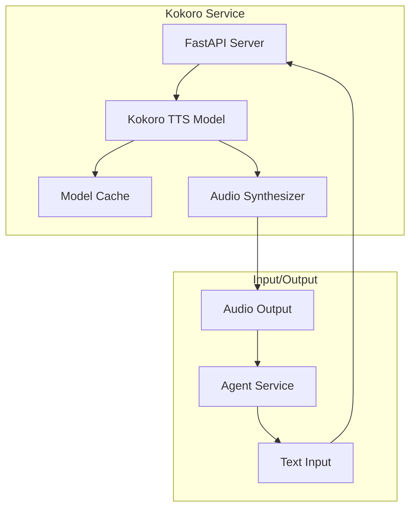

# Kokoro TTS Service Documentation

This document provides comprehensive documentation for the Kokoro Text-to-Speech (TTS) service, which handles speech synthesis in the Local Voice AI system.

## 📋 Overview

The Kokoro service provides text-to-speech functionality using the Kokoro voice synthesis model. It converts text responses from the LLM into natural-sounding audio for playback to users.

**Technology**: Kokoro FastAPI with CPU-based inference  
**Container Image**: `ghcr.io/remsky/kokoro-fastapi-cpu:latest`  
**Container**: `kokoro`  
**Internal Port**: 8880  
**External Port**: 8880  
**Voice**: `af_nova` (American female voice)

## 🏗️ Architecture

### Service Components



### Docker Compose Configuration

```yaml
# docker-compose.yml
kokoro:
  image: ghcr.io/remsky/kokoro-fastapi-cpu:latest
  ports:
    - "8880:8880"
  networks:
    - agent_network
```

## 🔧 Configuration

### Service Configuration

| Setting | Value | Description |
|---------|-------|-------------|
| **Image** | `ghcr.io/remsky/kokoro-fastapi-cpu:latest` | Pre-built Kokoro FastAPI image |
| **Port** | 8880 | HTTP API server port |
| **Voice** | `af_nova` | Default voice model (American female) |
| **Format** | WAV | Output audio format |
| **Sample Rate** | 22050 Hz | Audio sample rate |
| **Inference** | CPU-based | CPU inference (no GPU required) |

### Available Voices

| Voice ID | Description | Language | Gender |
|----------|-------------|----------|--------|
| `af_nova` | American voice | English | Female |
| `af_sarah` | American voice | English | Female |
| `af_sky` | American voice | English | Female |
| `am_adam` | American voice | English | Male |
| `am_michael` | American voice | English | Male |
| `bf_emma` | British voice | English | Female |
| `bm_george` | British voice | English | Male |

## 🔄 API Reference

### Groq-Compatible API

The Kokoro service exposes a Groq-compatible API endpoint for text-to-speech synthesis.

#### Speech Synthesis Endpoint

```http
POST /v1/audio/speech
Content-Type: application/json

{
  "model": "kokoro",
  "input": "Text to synthesize here",
  "voice": "af_nova",
  "response_format": "wav"
}
```

**Request Parameters**:

| Parameter | Type | Required | Description |
|-----------|------|----------|-------------|
| `model` | string | Yes | Model identifier (use `kokoro`) |
| `input` | string | Yes | Text to synthesize into speech |
| `voice` | string | No | Voice ID (default: `af_nova`) |
| `response_format` | string | No | Audio format (default: `wav`) |
| `speed` | float | No | Speech speed (0.25-4.0, default: 1.0) |

**Response**:
Binary audio data in WAV format.

#### Models Endpoint

```http
GET /v1/models
```

**Response**:
```json
{
  "object": "list",
  "data": [
    {
      "id": "kokoro",
      "object": "model",
      "created": 1234567890,
      "owned_by": "kokoro"
    }
  ]
}
```

#### Voices Endpoint

```http
GET /v1/voices
```

**Response**:
```json
{
  "voices": [
    {
      "voice_id": "af_nova",
      "name": "Nova (American Female)",
      "language": "en-US",
      "gender": "female"
    },
    {
      "voice_id": "am_adam",
      "name": "Adam (American Male)",
      "language": "en-US",
      "gender": "male"
    }
  ]
}
```

#### Health Check Endpoint

```http
GET /health
```

**Response**:
```json
{
  "status": "healthy",
  "model": "kokoro",
  "version": "1.0.0"
}
```

## 🔗 Integration with Agent Service

### Agent Configuration

```python
# agent/myagent.py
tts = groq.TTS(
    base_url="http://kokoro:8880/v1",
    model="kokoro",
    voice="af_nova"
)
```

### Usage Example

```python
async def synthesize_speech(text: str, voice: str = "af_nova") -> bytes:
    """
    Synthesize speech using Kokoro TTS service.
    
    This function sends text to the Kokoro service for
    text-to-speech conversion.
    
    Args:
        text: Text to synthesize into speech.
        voice: Voice ID to use for synthesis.
    
    Returns:
        Audio data in WAV format.
    
    Raises:
        ConnectionError: When Kokoro service is unavailable.
        TimeoutError: When synthesis takes too long.
    
    See Also:
        docs/services/agent.md: Agent service integration
        docs/architecture.md: System data flow
    """
    try:
        # LiveKit TTS plugin handles the API call
        result = await tts.synthesize(text, voice=voice)
        return result
    except Exception as e:
        logger.error(f"Kokoro synthesis failed: {e}")
        raise
```

### Voice Selection

```python
def select_voice(user_preference: str = None, context: str = "") -> str:
    """
    Select appropriate voice based on user preference or context.
    
    Args:
        user_preference: User's preferred voice (if any).
        context: Conversation context for voice selection.
    
    Returns:
        Voice ID that best matches the criteria.
    """
    # Default voice
    default_voice = "af_nova"
    
    # User preference overrides
    if user_preference:
        return user_preference
    
    # Context-based selection
    if "formal" in context.lower():
        return "bf_emma"  # British female for formal tone
    elif "casual" in context.lower():
        return "af_sky"   # American female for casual tone
    
    return default_voice
```

## 🚀 Deployment and Operations

### Starting the Service

```bash
# Using Docker Compose
docker-compose up kokoro

# Manual run
docker run -p 8880:8880 ghcr.io/remsky/kokoro-fastapi-cpu:latest
```

### Service Health Monitoring

```bash
# Check service status
docker-compose ps kokoro

# View logs
docker-compose logs -f kokoro

# Health check
curl http://localhost:8880/health

# Check available voices
curl http://localhost:8880/v1/voices
```

### Voice Testing

```bash
# Test speech synthesis
curl -X POST http://localhost:8880/v1/audio/speech \
  -H "Content-Type: application/json" \
  -d '{
    "model": "kokoro",
    "input": "Hello, this is a test of the Kokoro text-to-speech system.",
    "voice": "af_nova"
  }' \
  --output test_audio.wav

# Play the generated audio
play test_audio.wav  # Requires sox or similar player
```

## 🔧 Development Guidelines

### For Coding Agents

When working with the Kokoro service:

1. **Text Preprocessing**: Clean and format text before synthesis
2. **Voice Selection**: Choose appropriate voice for context
3. **Error Handling**: Implement proper error handling for service unavailability
4. **Audio Processing**: Handle audio format conversion if needed
5. **Performance**: Monitor synthesis latency and optimize text length

### Text Preprocessing

```python
import re
import html

def preprocess_text_for_tts(text: str) -> str:
    """
    Preprocess text for optimal TTS synthesis.
    
    Args:
        text: Raw text to preprocess.
    
    Returns:
        Cleaned text ready for synthesis.
    """
    # Remove HTML entities
    text = html.unescape(text)
    
    # Remove URLs
    text = re.sub(r'http[s]?://(?:[a-zA-Z]|[0-9]|[$-_@.&+]|[!*\\(\\),]|(?:%[0-9a-fA-F][0-9a-fA-F]))+', '', text)
    
    # Remove excessive whitespace
    text = re.sub(r'\s+', ' ', text).strip()
    
    # Handle abbreviations and acronyms
    text = text.replace("TTS", "text to speech")
    text = text.replace("STT", "speech to text")
    text = text.replace("LLM", "large language model")
    text = text.replace("AI", "artificial intelligence")
    
    # Add pauses for punctuation
    text = text.replace(".", ". ")
    text = text.replace("!", "! ")
    text = text.replace("?", "? ")
    
    # Limit length for better performance
    max_length = 500
    if len(text) > max_length:
        text = text[:max_length].rsplit(' ', 1)[0] + "..."
    
    return text
```

### Audio Processing

```python
import io
import wave
import numpy as np

def process_audio_output(audio_data: bytes) -> bytes:
    """
    Process audio output from Kokoro service.
    
    Args:
        audio_data: Raw audio data from Kokoro.
    
    Returns:
        Processed audio data ready for playback.
    """
    # Convert to numpy array if needed
    # Apply audio filters
    # Normalize volume
    # Convert format if necessary
    
    return audio_data

def split_text_for_synthesis(text: str, max_length: int = 300) -> list[str]:
    """
    Split long text into chunks for better synthesis.
    
    Args:
        text: Text to split.
        max_length: Maximum length per chunk.
    
    Returns:
        List of text chunks.
    """
    if len(text) <= max_length:
        return [text]
    
    # Split at sentence boundaries
    sentences = text.split('. ')
    chunks = []
    current_chunk = ""
    
    for sentence in sentences:
        if len(current_chunk + sentence) <= max_length:
            current_chunk += sentence + '. '
        else:
            if current_chunk:
                chunks.append(current_chunk.strip())
            current_chunk = sentence + '. '
    
    if current_chunk:
        chunks.append(current_chunk.strip())
    
    return chunks
```

### Error Handling

```python
async def safe_synthesize(text: str, voice: str = "af_nova", max_retries: int = 3) -> Optional[bytes]:
    """
    Safely synthesize speech with retry logic.
    
    Args:
        text: Text to synthesize.
        voice: Voice ID to use.
        max_retries: Maximum number of retry attempts.
    
    Returns:
        Audio data or None if all attempts fail.
    """
    for attempt in range(max_retries):
        try:
            # Preprocess text
            clean_text = preprocess_text_for_tts(text)
            
            # Synthesize speech
            result = await tts.synthesize(clean_text, voice=voice)
            return result
        except ConnectionError:
            logger.error(f"Kokoro service unavailable (attempt {attempt + 1})")
            if attempt < max_retries - 1:
                await asyncio.sleep(2 ** attempt)  # Exponential backoff
        except TimeoutError:
            logger.error(f"Kokoro synthesis timeout (attempt {attempt + 1})")
            if attempt < max_retries - 1:
                await asyncio.sleep(1)
        except Exception as e:
            logger.error(f"Unexpected error in synthesis: {e}")
            break
    
    return None
```

## 🚨 Troubleshooting

### Common Issues

#### Service Unavailable
```bash
# Check if service is running
docker-compose ps kokoro

# Check logs for errors
docker-compose logs kokoro

# Restart service
docker-compose restart kokoro

# Check network connectivity
docker-compose exec agent ping kokoro
```

#### Audio Quality Issues
```bash
# Test with different voices
curl -X POST http://localhost:8880/v1/audio/speech \
  -H "Content-Type: application/json" \
  -d '{"model": "kokoro", "input": "Test", "voice": "af_sky"}' \
  --output test_sky.wav

# Test with different text lengths
curl -X POST http://localhost:8880/v1/audio/speech \
  -H "Content-Type: application/json" \
  -d '{"model": "kokoro", "input": "Short test", "voice": "af_nova"}' \
  --output test_short.wav
```

#### Performance Issues
```bash
# Check resource usage
docker stats kokoro

# Monitor synthesis time
time curl -X POST http://localhost:8880/v1/audio/speech \
  -H "Content-Type: application/json" \
  -d '{"model": "kokoro", "input": "Performance test", "voice": "af_nova"}' \
  --output /dev/null
```

### Debug Mode

```bash
# Enable verbose logging
docker-compose exec kokoro python -m uvicorn main:app --log-level debug

# Test API directly
curl -v http://localhost:8880/v1/models

# Check voice availability
curl -v http://localhost:8880/v1/voices
```

## 📈 Performance Optimization

### Synthesis Optimization

- **Text Length**: Keep text chunks under 300 characters for optimal performance
- **Voice Caching**: Use consistent voice selection to benefit from model caching
- **Batch Processing**: Process multiple text chunks when possible

### Audio Optimization

```python
# Optimize audio for real-time playback
def optimize_audio_for_streaming(audio_data: bytes) -> bytes:
    """
    Optimize audio data for real-time streaming.
    
    Args:
        audio_data: Raw audio data from Kokoro.
    
    Returns:
        Optimized audio data for streaming.
    """
    # Convert to appropriate format
    # Optimize bitrate for streaming
    # Add metadata for seeking
    
    return audio_data

# Preload commonly used responses
COMMON_RESPONSES = {
    "hello": "Hello! How can I help you today?",
    "goodbye": "Goodbye! Have a great day!",
    "error": "I'm sorry, I didn't understand that."
}

async def preload_common_responses():
    """Preload audio for common responses."""
    for key, text in COMMON_RESPONSES.items():
        audio = await safe_synthesize(text)
        if audio:
            # Cache the audio
            cache.set(f"tts:{key}", audio)
```

### Caching Strategy

```python
from functools import lru_cache
import hashlib

@lru_cache(maxsize=100)
def get_cached_audio(text_hash: str) -> Optional[bytes]:
    """
    Cache synthesized audio to avoid re-generation.
    
    Args:
        text_hash: Hash of text for cache key.
    
    Returns:
        Cached audio data or None if not found.
    """
    # Implementation for audio caching
    pass

def hash_text_for_cache(text: str, voice: str) -> str:
    """Generate hash for audio caching."""
    content = f"{text}:{voice}"
    return hashlib.md5(content.encode()).hexdigest()
```

## 🔍 Testing

### Unit Testing

```python
import pytest
from unittest.mock import AsyncMock, patch

@pytest.mark.asyncio
async def test_kokoro_synthesis():
    """Test Kokoro synthesis functionality."""
    # Mock Kokoro service
    with patch('livekit.plugins.groq.TTS') as mock_tts:
        mock_tts.return_value.synthesize = AsyncMock(
            return_value=b"fake_audio_data"
        )
        
        # Test synthesis
        tts_service = mock_tts()
        result = await tts_service.synthesize("test text")
        
        assert result == b"fake_audio_data"
```

### Integration Testing

```bash
# Test service health
curl -f http://localhost:8880/health || exit 1

# Test synthesis
curl -X POST http://localhost:8880/v1/audio/speech \
  -H "Content-Type: application/json" \
  -d '{"model": "kokoro", "input": "Hello world", "voice": "af_nova"}' \
  --output test.wav

# Verify audio file was created
if [ -f test.wav ]; then
    echo "Synthesis successful"
    rm test.wav
else
    exit 1
fi
```

### Load Testing

```bash
# Test concurrent requests
for i in {1..5}; do
  curl -X POST http://localhost:8880/v1/audio/speech \
    -H "Content-Type: application/json" \
    -d '{"model": "kokoro", "input": "Test message '$i'", "voice": "af_nova"}' \
    --output test_$i.wav &
done
wait

# Check all files were created
for i in {1..5}; do
  if [ -f test_$i.wav ]; then
    echo "Request $i successful"
    rm test_$i.wav
  else
    echo "Request $i failed"
  fi
done
```

## 📊 Monitoring and Metrics

### Performance Metrics

- **Synthesis Latency**: Time from text to audio output
- **Audio Quality**: Subjective quality assessment
- **Error Rate**: Failed synthesis attempts
- **Resource Usage**: CPU and memory consumption

### Logging

```python
# Configure logging for synthesis monitoring
import logging

logger = logging.getLogger("kokoro_service")

async def synthesize_with_metrics(text: str, voice: str = "af_nova") -> bytes:
    """Synthesize with performance metrics."""
    start_time = time.time()
    
    try:
        result = await tts.synthesize(text, voice=voice)
        duration = time.time() - start_time
        
        logger.info(f"Synthesis completed", extra={
            "duration": duration,
            "text_length": len(text),
            "voice": voice,
            "audio_size": len(result)
        })
        
        return result
    except Exception as e:
        logger.error(f"Synthesis failed", extra={
            "error": str(e),
            "text_length": len(text),
            "voice": voice
        })
        raise
```

---

*For Agent service integration, see [docs/services/agent.md](agent.md). For system architecture, see [docs/architecture.md](../architecture.md).*