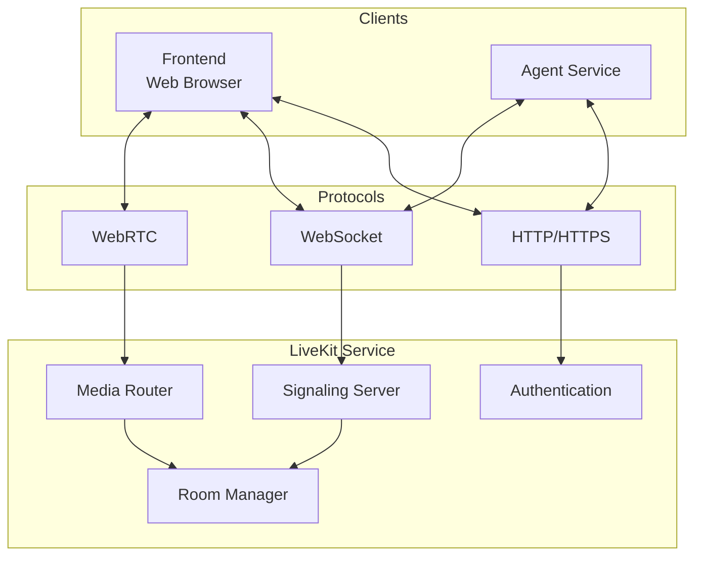

# LiveKit Service Documentation

This document provides comprehensive documentation for the LiveKit service, which provides WebRTC signaling and media routing in the Local Voice AI system.

## 📋 Overview

The LiveKit service provides real-time WebRTC signaling, media routing, and room management for the voice assistant system. It enables low-latency audio communication between the frontend and agent service.

**Technology**: LiveKit Server (Go)  
**Container Image**: `livekit/livekit-server:latest`  
**Container**: `livekit`  
**HTTP Port**: 7880  
**HTTPS Port**: 7881  
**Protocol**: WebRTC, WebSocket, HTTP

## 🏗️ Architecture

### Service Components



### Docker Compose Configuration

```yaml
# docker-compose.yml
livekit:
  image: livekit/livekit-server:latest
  ports:
    - "7880:7880"
    - "7881:7881"
  command: --dev --bind "0.0.0.0"
  networks:
    - agent_network
```

## 🔧 Configuration

### Environment Variables

| Variable | Default | Description |
|----------|---------|-------------|
| `LIVEKIT_HOST` | `0.0.0.0` | Host address to bind to |
| `LIVEKIT_PORT` | `7880` | HTTP port for signaling |
| `LIVEKIT_TLS_PORT` | `7881` | HTTPS port for secure signaling |
| `LIVEKIT_API_KEY` | `devkey` | API key for authentication |
| `LIVEKIT_API_SECRET` | `secret` | API secret for JWT token generation |
| `LIVEKIT_DEV` | `true` | Development mode flag |

### Development Mode Configuration

The service runs in development mode with the following settings:
- Self-signed TLS certificates
- Permissive CORS policy
- Debug logging enabled
- No authentication required for basic operations

### Room Configuration

- **Room Creation**: Dynamic room creation via API
- **Room Lifetime**: Rooms persist while participants are active
- **Participant Limits**: No explicit limits in development mode
- **Media Types**: Audio-only (no video by default)

## 🔄 API Reference

### Authentication API

LiveKit uses JWT-based authentication for secure access.

#### Token Generation

```python
# Frontend token generation (in voice-assistant-frontend)
from livekit_server_sdk import AccessToken

def create_participant_token(identity: str, room_name: str) -> str:
    """
    Create JWT token for participant authentication.
    
    Args:
        identity: Unique participant identifier.
        room_name: Name of the room to join.
    
    Returns:
        JWT token for authentication.
    """
    token = AccessToken(
        api_key="devkey",
        api_secret="secret",
        identity=identity,
        ttl=15 * 60  # 15 minutes
    )
    
    token.add_grants({
        "room": room_name,
        "room_join": True,
        "can_publish": True,
        "can_subscribe": True,
        "can_publish_data": True
    })
    
    return token.to_jwt()
```

### REST API Endpoints

#### List Rooms

```http
GET /rooms
Authorization: Bearer <admin_token>
```

**Response**:
```json
{
  "rooms": [
    {
      "sid": "RM_xxxxxxxxxxxx",
      "name": "voice_assistant_room_12345",
      "empty_timeout": 300,
      "max_participants": 0,
      "creation_time": 1697704200,
      "turn_password": ""
    }
  ]
}
```

#### Create Room

```http
POST /rooms
Authorization: Bearer <admin_token>
Content-Type: application/json

{
  "name": "new_room_name",
  "empty_timeout": 300,
  "max_participants": 20
}
```

#### Delete Room

```http
DELETE /rooms/{room_name}
Authorization: Bearer <admin_token>
```

#### List Participants

```http
GET /rooms/{room_name}/participants
Authorization: Bearer <admin_token>
```

**Response**:
```json
{
  "participants": [
    {
      "sid": "PA_xxxxxxxxxxxx",
      "identity": "voice_assistant_user_12345",
      "state": "active",
      "joined_at": 1697704200,
      "name": "",
      "metadata": "",
      "kind": 0,
      "tracks": [
        {
          "sid": "TR_xxxxxxxxxxxx",
          "type": "audio",
          "name": "",
          "muted": false,
          "width": 0,
          "height": 0,
          "simulcasted": false,
          "disable_dtx": false,
          "source": 1
        }
      ]
    }
  ]
}
```

### WebSocket API

#### Connection URL

```
ws://localhost:7880/?token=<jwt_token>
```

#### Message Types

- **Join Room**: Client joins a specific room
- **Leave Room**: Client leaves current room
- **Track Published**: Client publishes audio track
- **Track Subscribed**: Client subscribes to remote track
- **Data Message**: Client sends/receives data messages

## 🔗 Integration with Frontend

### Connection Details API

The frontend provides an API endpoint for connection details:

```typescript
// voice-assistant-frontend/app/api/connection-details/route.ts
export type ConnectionDetails = {
  serverUrl: string;
  roomName: string;
  participantName: string;
  participantToken: string;
};

export async function GET(): Promise<NextResponse> {
  // Generate random room and participant names
  const participantIdentity = `voice_assistant_user_${Math.floor(Math.random() * 10_000)}`;
  const roomName = `voice_assistant_room_${Math.floor(Math.random() * 10_000)}`;
  
  // Generate participant token
  const participantToken = await createParticipantToken(
    { identity: participantIdentity },
    roomName
  );

  // Return connection details
  const data: ConnectionDetails = {
    serverUrl: LIVEKIT_URL,
    roomName,
    participantToken,
    participantName: participantIdentity,
  };

  return NextResponse.json(data);
}
```

### Frontend Integration

```typescript
// voice-assistant-frontend/app/page.tsx
import { Room } from "livekit-client";

const onConnectButtonClicked = useCallback(async () => {
  // Get connection details from API
  const response = await fetch("/api/connection-details");
  const connectionDetailsData: ConnectionDetails = await response.json();

  // Connect to LiveKit room
  await room.connect(
    connectionDetailsData.serverUrl, 
    connectionDetailsData.participantToken
  );
  
  // Enable microphone
  await room.localParticipant.setMicrophoneEnabled(true);
}, [room]);
```

## 🔗 Integration with Agent Service

### Agent Configuration

```python
# agent/myagent.py
import os
from livekit.agents import JobContext, cli

async def entrypoint(ctx: JobContext):
    """
    Entry point for agent connection to LiveKit.
    
    This function is called when the agent connects to a LiveKit room.
    It sets up the agent session and starts handling audio streams.
    
    Args:
        ctx: Job context containing room and connection information.
    
    See Also:
        docs/services/agent.md: Agent service documentation
        docs/architecture.md: System data flow
    """
    await ctx.connect()
    
    session = AgentSession()
    
    await session.start(
        agent=LocalAgent(),
        room=ctx.room
    )

if __name__ == "__main__":
    cli.run_app(WorkerOptions(entrypoint_fnc=entrypoint))
```

### Environment Configuration

```bash
# Agent service environment variables
LIVEKIT_HOST=ws://livekit:7880
LIVEKIT_API_KEY=devkey
LIVEKIT_API_SECRET=secret
LIVEKIT_AGENT_PORT=7880
```

## 🚀 Deployment and Operations

### Starting the Service

```bash
# Using Docker Compose
docker-compose up livekit

# Manual run
docker run -p 7880:7880 -p 7881:7881 \
  livekit/livekit-server:latest \
  --dev --bind 0.0.0.0
```

### Service Health Monitoring

```bash
# Check service status
docker-compose ps livekit

# View logs
docker-compose logs -f livekit

# Health check
curl http://localhost:7880/

# Check TLS endpoint
curl -k https://localhost:7881/
```

### Room Management

```bash
# List active rooms
curl -H "Authorization: Bearer devkey:secret" \
  http://localhost:7880/rooms

# Create room
curl -X POST \
  -H "Authorization: Bearer devkey:secret" \
  -H "Content-Type: application/json" \
  -d '{"name": "test_room"}' \
  http://localhost:7880/rooms

# Delete room
curl -X DELETE \
  -H "Authorization: Bearer devkey:secret" \
  http://localhost:7880/rooms/test_room
```

## 🔧 Development Guidelines

### For Coding Agents

When working with the LiveKit service:

1. **Token Management**: Handle JWT tokens properly with appropriate expiration
2. **Error Handling**: Implement robust error handling for connection failures
3. **Room Management**: Clean up rooms when participants disconnect
4. **Audio Routing**: Ensure proper audio track publishing and subscription
5. **Security**: Use proper authentication in production environments

### Connection Management

```python
# Robust connection handling
class LiveKitConnection:
    """Manages LiveKit connection with retry logic."""
    
    def __init__(self, url: str, token: str):
        self.url = url
        self.token = token
        self.room = None
        self.max_retries = 3
    
    async def connect_with_retry(self) -> bool:
        """Connect to LiveKit with retry logic."""
        for attempt in range(self.max_retries):
            try:
                self.room = Room()
                await self.room.connect(self.url, self.token)
                logger.info(f"Connected to LiveKit (attempt {attempt + 1})")
                return True
            except Exception as e:
                logger.error(f"Connection failed (attempt {attempt + 1}): {e}")
                if attempt < self.max_retries - 1:
                    await asyncio.sleep(2 ** attempt)
                else:
                    raise
        return False
    
    async def disconnect(self):
        """Cleanly disconnect from LiveKit."""
        if self.room:
            await self.room.disconnect()
            self.room = None
```

### Audio Track Management

```python
# Audio track publishing and subscription
class AudioTrackManager:
    """Manages audio tracks in LiveKit room."""
    
    def __init__(self, room: Room):
        self.room = room
        self.local_track = None
        self.remote_tracks = {}
    
    async def publish_microphone(self) -> bool:
        """Publish local microphone track."""
        try:
            # Enable microphone
            await self.room.localParticipant.setMicrophoneEnabled(True)
            
            # Get microphone track
            self.local_track = self.room.localParticipant.getTrackPublication(
                Track.Source.Microphone
            )
            
            logger.info("Microphone track published successfully")
            return True
        except Exception as e:
            logger.error(f"Failed to publish microphone: {e}")
            return False
    
    def on_track_subscribed(self, track: Track, publication: TrackPublication, participant: Participant):
        """Handle remote track subscription."""
        if track.kind == Track.Kind.AUDIO:
            self.remote_tracks[participant.sid] = track
            logger.info(f"Subscribed to audio track from {participant.identity}")
```

### Error Handling

```python
# Comprehensive error handling
async def handle_livekit_errors(room: Room):
    """Handle LiveKit connection and media errors."""
    
    @room.on("disconnected")
    def on_disconnected():
        logger.warning("Disconnected from LiveKit room")
        # Implement reconnection logic
    
    @room.on("reconnected")
    def on_reconnected():
        logger.info("Reconnected to LiveKit room")
    
    @room.on("mediaTrackError")
    def on_media_track_error(track: Track, error: Error):
        logger.error(f"Media track error: {error}")
        # Implement track recovery logic
    
    @room.on("connectionQualityChanged")
    def on_connection_quality_changed(quality: ConnectionQuality):
        if quality == ConnectionQuality.POOR:
            logger.warning("Poor connection quality detected")
        elif quality == ConnectionQuality.EXCELLENT:
            logger.info("Excellent connection quality")
```

## 🚨 Troubleshooting

### Common Issues

#### Connection Failures
```bash
# Check if service is running
docker-compose ps livekit

# Check logs for errors
docker-compose logs livekit

# Test HTTP endpoint
curl -v http://localhost:7880/

# Test WebSocket endpoint
curl -i -N \
  -H "Connection: Upgrade" \
  -H "Upgrade: websocket" \
  -H "Sec-WebSocket-Key: test" \
  -H "Sec-WebSocket-Version: 13" \
  http://localhost:7880/
```

#### Audio Issues
```bash
# Check room participants
curl -H "Authorization: Bearer devkey:secret" \
  http://localhost:7880/rooms/room_name/participants

# Check track status
curl -H "Authorization: Bearer devkey:secret" \
  http://localhost:7880/rooms/room_name/participants/participant_sid/tracks
```

#### Token Issues
```bash
# Generate test token
python3 -c "
from livekit_server_sdk import AccessToken
token = AccessToken('devkey', 'secret', 'test_user')
token.add_grants({'room': 'test_room', 'room_join': True})
print(token.to_jwt())
"

# Test token validity
curl -H "Authorization: Bearer <token>" \
  http://localhost:7880/rooms
```

### Debug Mode

```bash
# Enable debug logging
docker-compose exec livekit livekit-server --dev --debug

# Monitor WebSocket connections
docker-compose logs -f livekit | grep "websocket"

# Check room events
docker-compose logs -f livekit | grep "room"
```

## 📈 Performance Optimization

### Connection Optimization

- **Keep-Alive**: Use WebSocket keep-alive to maintain connections
- **Reconnection**: Implement exponential backoff for reconnection attempts
- **Quality Adaptation**: Adjust audio quality based on network conditions

### Audio Optimization

```python
# Optimize audio settings for voice
VOICE_AUDIO_SETTINGS = {
    "bitrate": 32000,  # 32kbps for voice
    "sample_rate": 16000,  # 16kHz for speech
    "channels": 1,  # Mono for voice
    "echo_cancellation": True,
    "noise_suppression": True
}

async def configure_audio_for_voice(room: Room):
    """Configure audio settings optimized for voice."""
    # Apply voice-optimized settings
    await room.localParticipant.setMicrophoneSettings(VOICE_AUDIO_SETTINGS)
```

### Room Management

```python
# Efficient room cleanup
class RoomManager:
    """Manages LiveKit rooms with automatic cleanup."""
    
    def __init__(self):
        self.active_rooms = {}
        self.cleanup_interval = 300  # 5 minutes
    
    async def cleanup_empty_rooms(self):
        """Clean up rooms that have been empty for too long."""
        for room_name, room_info in list(self.active_rooms.items()):
            if room_info["participant_count"] == 0:
                if time.time() - room_info["last_empty"] > self.cleanup_interval:
                    await self.delete_room(room_name)
                    del self.active_rooms[room_name]
                    logger.info(f"Cleaned up empty room: {room_name}")
```

## 🔍 Testing

### Unit Testing

```python
import pytest
from unittest.mock import Mock, patch

@pytest.mark.asyncio
async def test_livekit_connection():
    """Test LiveKit connection functionality."""
    with patch('livekit.client.Room') as mock_room:
        mock_room.return_value.connect = Mock()
        
        connection = LiveKitConnection("ws://test", "test_token")
        result = await connection.connect_with_retry()
        
        assert result is True
        mock_room.return_value.connect.assert_called_once()
```

### Integration Testing

```bash
# Test service health
curl -f http://localhost:7880/ || exit 1

# Test room creation
curl -X POST \
  -H "Authorization: Bearer devkey:secret" \
  -H "Content-Type: application/json" \
  -d '{"name": "test_room"}' \
  http://localhost:7880/rooms

# Verify room exists
curl -H "Authorization: Bearer devkey:secret" \
  http://localhost:7880/rooms | grep -q "test_room" || exit 1

# Clean up test room
curl -X DELETE \
  -H "Authorization: Bearer devkey:secret" \
  http://localhost:7880/rooms/test_room
```

### Load Testing

```bash
# Test concurrent connections
for i in {1..10}; do
  # Generate token for test user
  TOKEN=$(python3 -c "
from livekit_server_sdk import AccessToken
token = AccessToken('devkey', 'secret', 'test_user_$i')
token.add_grants({'room': 'load_test_room', 'room_join': True})
print(token.to_jwt())
")
  
  # Test connection
  curl -s -o /dev/null -w "%{http_code}" \
    -H "Authorization: Bearer $TOKEN" \
    http://localhost:7880/rooms &
done
wait
```

## 📊 Monitoring and Metrics

### Performance Metrics

- **Connection Latency**: Time to establish WebSocket connection
- **Audio Latency**: Time from audio capture to playback
- **Packet Loss**: Percentage of audio packets lost
- **Connection Quality**: Overall connection quality rating

### Logging

```python
# Configure logging for LiveKit monitoring
import logging

logger = logging.getLogger("livekit_service")

def setup_livekit_logging(room: Room):
    """Set up comprehensive logging for LiveKit events."""
    
    @room.on("participantConnected")
    def on_participant_connected(participant: Participant):
        logger.info(f"Participant connected: {participant.identity}")
    
    @room.on("participantDisconnected")
    def on_participant_disconnected(participant: Participant):
        logger.info(f"Participant disconnected: {participant.identity}")
    
    @room.on("trackSubscribed")
    def on_track_subscribed(track: Track, publication: TrackPublication, participant: Participant):
        logger.info(f"Track subscribed: {track.kind} from {participant.identity}")
    
    @room.on("trackUnsubscribed")
    def on_track_unsubscribed(track: Track, publication: TrackPublication, participant: Participant):
        logger.info(f"Track unsubscribed: {track.kind} from {participant.identity}")
```

---

*For Frontend integration, see [docs/services/frontend.md](frontend.md). For Agent service integration, see [docs/services/agent.md](agent.md). For system architecture, see [docs/architecture.md](../architecture.md).*