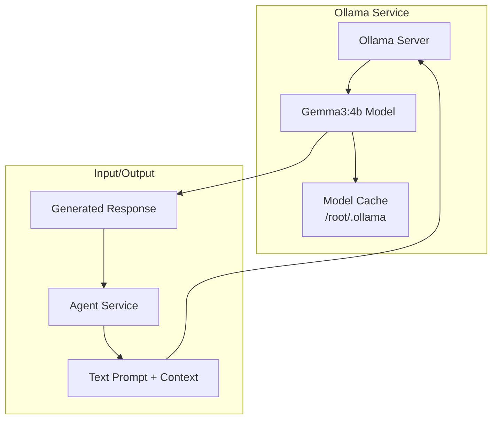

# Ollama LLM Service Documentation

This document provides comprehensive documentation for the Ollama Language Model (LLM) service, which handles language model inference in the Local Voice AI system.

## 📋 Overview

The Ollama service provides local language model inference using the Ollama platform. It runs the Gemma3:4b model for generating responses to user queries, enhanced with context from the RAG system.

**Technology**: Ollama with Gemma3:4b model  
**Container**: `ollama`  
**Internal Port**: 11434  
**External Port**: 11434  
**Data Directory**: `/root/.ollama` (mounted volume)  
**Memory Allocation**: 6-8GB

## 🏗️ Architecture

### Service Components



### Docker Configuration

```dockerfile
# ollama/Dockerfile
FROM ollama/ollama:latest

# Copy entrypoint script
COPY entrypoint.sh /entrypoint.sh
RUN chmod +x /entrypoint.sh

# Set working directory
WORKDIR /app

# Expose port
EXPOSE 11434

# Start Ollama server
ENTRYPOINT ["/entrypoint.sh"]
```

### Entrypoint Script

```bash
#!/bin/bash
# ollama/entrypoint.sh

# Start Ollama server in background
ollama serve &

# Wait for server to be ready
echo "Waiting for Ollama server to start..."
while ! curl -s http://localhost:11434/api/tags > /dev/null; do
    sleep 1
done
echo "Ollama server is ready!"

# Pull the model if not already present
echo "Pulling Gemma3:4b model..."
ollama pull gemma3:4b

# Keep the server running
wait
```

### Docker Compose Configuration

```yaml
# docker-compose.yml
ollama:
  build:
    context: ./ollama
  ports:
    - "11434:11434"
  volumes:
    - ollama:/root/.ollama
  networks:
    - agent_network
  deploy:
    resources:
      limits:
        memory: 8G
      reservations:
        memory: 6G
```

## 🔧 Configuration

### Environment Variables

| Variable | Default | Description |
|----------|---------|-------------|
| `OLLAMA_HOST` | `0.0.0.0` | Host address for Ollama server |
| `OLLAMA_PORT` | `11434` | Port for Ollama server |
| `OLLAMA_MODELS` | `/root/.ollama` | Directory for model storage |

### Model Configuration

- **Model**: `gemma3:4b`
- **Model Size**: ~4.7GB
- **Context Window**: 8192 tokens
- **Quantization**: 4-bit (default for memory efficiency)
- **Parameters**: 4 billion parameters

### Resource Requirements

| Resource | Minimum | Recommended |
|----------|---------|-------------|
| Memory | 6GB | 8GB |
| Storage | 10GB | 20GB |
| CPU | 4 cores | 8 cores |

### Volume Configuration

```yaml
volumes:
  ollama:
    driver: local
```

The `ollama` volume persists:
- Downloaded models
- Model cache
- Configuration files

## 🔄 API Reference

### Ollama REST API

The Ollama service exposes a REST API for model inference and management.

#### Generate Endpoint

```http
POST /api/generate
Content-Type: application/json

{
  "model": "gemma3:4b",
  "prompt": "User query here",
  "stream": false,
  "options": {
    "temperature": 0.7,
    "top_p": 0.9,
    "max_tokens": 1000
  }
}
```

**Request Parameters**:

| Parameter | Type | Required | Description |
|-----------|------|----------|-------------|
| `model` | string | Yes | Model name to use |
| `prompt` | string | Yes | Input prompt for generation |
| `stream` | boolean | No | Stream response (default: false) |
| `options` | object | No | Generation parameters |
| `system` | string | No | System prompt |
| `template` | string | No | Custom prompt template |

**Response**:
```json
{
  "model": "gemma3:4b",
  "created_at": "2025-10-19T14:50:00.000Z",
  "response": "Generated response here",
  "done": true,
  "total_duration": 1234567890,
  "prompt_eval_count": 10,
  "prompt_eval_duration": 123456789,
  "eval_count": 25,
  "eval_duration": 123456789
}
```

#### Chat Endpoint

```http
POST /api/chat
Content-Type: application/json

{
  "model": "gemma3:4b",
  "messages": [
    {
      "role": "system",
      "content": "You are a helpful assistant."
    },
    {
      "role": "user",
      "content": "User query here"
    }
  ],
  "stream": false,
  "options": {
    "temperature": 0.7
  }
}
```

#### Models Endpoint

```http
GET /api/tags
```

**Response**:
```json
{
  "models": [
    {
      "name": "gemma3:4b",
      "modified_at": "2025-10-19T14:50:00.000Z",
      "size": 4734926848,
      "digest": "sha256:abc123..."
    }
  ]
}
```

#### Health Check

```http
GET /
```

Returns "Ollama is running" if service is healthy.

## 🔗 Integration with Agent Service

### Agent Configuration

```python
# agent/myagent.py
llm = openai.LLM(
    base_url="http://ollama:11434/v1",
    model="gemma3:4b",
    timeout=30
)
```

### Usage Example

```python
async def generate_response(prompt: str, context: str = "") -> str:
    """
    Generate response using Ollama LLM with RAG context.
    
    This function sends a prompt to the Ollama service for
    language model inference, optionally including RAG context.
    
    Args:
        prompt: User query or prompt text.
        context: Optional RAG context to include.
    
    Returns:
        Generated response text.
    
    Raises:
        ConnectionError: When Ollama service is unavailable.
        TimeoutError: When generation takes too long.
    
    See Also:
        docs/services/agent.md: Agent service integration
        docs/architecture.md: System data flow
    """
    try:
        # Combine prompt with context
        full_prompt = f"{context}\n\nUser: {prompt}\nAssistant:" if context else prompt
        
        # LiveKit LLM plugin handles the API call
        result = await llm.achat([
            {"role": "system", "content": "You are a helpful voice assistant."},
            {"role": "user", "content": full_prompt}
        ])
        
        return result.choices[0].message.content
    except Exception as e:
        logger.error(f"Ollama generation failed: {e}")
        raise
```

## 🚀 Deployment and Operations

### Starting the Service

```bash
# Using Docker Compose
docker-compose up ollama

# Manual build and run
cd ollama
docker build -t ollama-llm .
docker run -p 11434:11434 -v ollama:/root/.ollama ollama-llm
```

### Model Management

```bash
# List available models
curl http://localhost:11434/api/tags

# Pull new model
docker-compose exec ollama ollama pull llama2:7b

# Show model info
docker-compose exec ollama ollama show gemma3:4b

# Remove model
docker-compose exec ollama ollama rm gemma3:4b
```

### Service Health Monitoring

```bash
# Check service status
docker-compose ps ollama

# View logs
docker-compose logs -f ollama

# Health check
curl http://localhost:11434/

# Check model status
curl http://localhost:11434/api/tags
```

## 🔧 Development Guidelines

### For Coding Agents

When working with the Ollama service:

1. **Prompt Engineering**: Design effective prompts for the Gemma3 model
2. **Context Management**: Handle RAG context efficiently within token limits
3. **Error Handling**: Implement proper error handling for service unavailability
4. **Timeout Management**: Set appropriate timeouts for generation requests
5. **Resource Monitoring**: Monitor memory usage and performance

### Prompt Engineering

```python
def create_effective_prompt(user_query: str, rag_context: str = "") -> str:
    """
    Create an effective prompt for Gemma3 model.
    
    Gemma3 performs best with clear, structured prompts that
    include relevant context and explicit instructions.
    
    Args:
        user_query: The user's original query.
        rag_context: Retrieved context from RAG system.
    
    Returns:
        Formatted prompt optimized for Gemma3.
    """
    system_prompt = "You are a helpful voice assistant. Provide concise, accurate responses."
    
    if rag_context:
        prompt = f"""
{system_prompt}

Context:
{rag_context}

User Query: {user_query}

Please provide a helpful response based on the context above. Keep your answer concise and conversational.
"""
    else:
        prompt = f"""
{system_prompt}

User Query: {user_query}

Please provide a helpful response. Keep your answer concise and conversational.
"""
    
    return prompt.strip()
```

### Context Management

```python
def manage_context_length(context: str, max_tokens: int = 4000) -> str:
    """
    Manage context length to fit within model limits.
    
    Args:
        context: Full context text.
        max_tokens: Maximum tokens for context.
    
    Returns:
        Truncated or summarized context.
    """
    # Rough estimation: 1 token ≈ 4 characters
    max_chars = max_tokens * 4
    
    if len(context) <= max_chars:
        return context
    
    # Truncate to fit within limits
    truncated = context[:max_chars]
    
    # Try to end at sentence boundary
    last_period = truncated.rfind('.')
    if last_period > max_chars * 0.8:  # If we don't lose too much
        return truncated[:last_period + 1]
    
    return truncated + "..."
```

### Error Handling

```python
async def safe_generate(prompt: str, max_retries: int = 3) -> Optional[str]:
    """
    Safely generate response with retry logic.
    
    Args:
        prompt: Input prompt for generation.
        max_retries: Maximum number of retry attempts.
    
    Returns:
        Generated response or None if all attempts fail.
    """
    for attempt in range(max_retries):
        try:
            result = await llm.achat([
                {"role": "user", "content": prompt}
            ])
            return result.choices[0].message.content
        except ConnectionError:
            logger.error(f"Ollama service unavailable (attempt {attempt + 1})")
            if attempt < max_retries - 1:
                await asyncio.sleep(2 ** attempt)  # Exponential backoff
        except TimeoutError:
            logger.error(f"Ollama generation timeout (attempt {attempt + 1})")
            if attempt < max_retries - 1:
                await asyncio.sleep(1)
        except Exception as e:
            logger.error(f"Unexpected error in generation: {e}")
            break
    
    return None
```

## 🚨 Troubleshooting

### Common Issues

#### Service Unavailable
```bash
# Check if service is running
docker-compose ps ollama

# Check logs for errors
docker-compose logs ollama

# Restart service
docker-compose restart ollama
```

#### Model Loading Issues
```bash
# Check if model is downloaded
curl http://localhost:11434/api/tags

# Force model re-download
docker-compose exec ollama ollama pull gemma3:4b

# Check model integrity
docker-compose exec ollama ollama show gemma3:4b
```

#### Memory Issues
```bash
# Check memory usage
docker stats ollama

# Check system memory
free -h

# Reduce model size or use quantization
docker-compose exec ollama ollama pull gemma3:4b-q4_K_M
```

#### Slow Generation
```bash
# Check resource usage
docker stats ollama

# Monitor generation time
time curl -X POST http://localhost:11434/api/generate \
  -H "Content-Type: application/json" \
  -d '{"model": "gemma3:4b", "prompt": "Hello"}'
```

### Debug Mode

```bash
# Enable verbose logging
docker-compose exec ollama ollama serve --verbose

# Test API directly
curl -v http://localhost:11434/api/tags

# Check model loading
docker-compose exec ollama ollama run gemma3:4b "Hello"
```

## 📈 Performance Optimization

### Model Optimization

- **Quantization**: Use 4-bit quantization for memory efficiency
- **Context Caching**: Cache common prompts and responses
- **Batch Processing**: Process multiple requests when possible

### Generation Optimization

```python
# Optimize generation parameters
OPTIMAL_PARAMS = {
    "temperature": 0.7,  # Balance creativity and coherence
    "top_p": 0.9,        # Nucleus sampling
    "max_tokens": 500,   # Limit response length for voice
    "repeat_penalty": 1.1  # Reduce repetition
}

async def optimized_generate(prompt: str) -> str:
    """Generate response with optimized parameters."""
    result = await llm.achat([
        {"role": "user", "content": prompt}
    ], **OPTIMAL_PARAMS)
    
    return result.choices[0].message.content
```

### Caching Strategy

```python
from functools import lru_cache
import hashlib

@lru_cache(maxsize=50)
def get_cached_response(prompt_hash: str) -> Optional[str]:
    """
    Cache responses to avoid re-generating identical prompts.
    
    Args:
        prompt_hash: Hash of prompt for cache key.
    
    Returns:
        Cached response or None if not found.
    """
    # Implementation for response caching
    pass

def hash_prompt(prompt: str) -> str:
    """Generate hash for prompt caching."""
    return hashlib.md5(prompt.encode()).hexdigest()
```

## 🔍 Testing

### Unit Testing

```python
import pytest
from unittest.mock import AsyncMock, patch

@pytest.mark.asyncio
async def test_ollama_generation():
    """Test Ollama generation functionality."""
    # Mock Ollama service
    with patch('livekit.plugins.openai.LLM') as mock_llm:
        mock_response = MockLLMResponse()
        mock_response.choices = [MockChoice()]
        mock_response.choices[0].message.content = "Test response"
        
        mock_llm.return_value.achat = AsyncMock(return_value=mock_response)
        
        # Test generation
        llm_service = mock_llm()
        result = await llm_service.achat([{"role": "user", "content": "test"}])
        
        assert result.choices[0].message.content == "Test response"
```

### Integration Testing

```bash
# Test service health
curl -f http://localhost:11434/ || exit 1

# Test model availability
curl -f http://localhost:11434/api/tags | grep -q "gemma3:4b" || exit 1

# Test generation
curl -X POST http://localhost:11434/api/generate \
  -H "Content-Type: application/json" \
  -d '{"model": "gemma3:4b", "prompt": "Hello", "stream": false}' \
  | jq -e '.response' || exit 1
```

### Load Testing

```bash
# Test concurrent requests
for i in {1..5}; do
  curl -X POST http://localhost:11434/api/generate \
    -H "Content-Type: application/json" \
    -d '{"model": "gemma3:4b", "prompt": "Hello", "stream": false}' &
done
wait
```

## 📊 Monitoring and Metrics

### Performance Metrics

- **Generation Latency**: Time from prompt to response
- **Tokens per Second**: Generation speed
- **Memory Usage**: RAM consumption during generation
- **Error Rate**: Failed generation attempts

### Logging

```python
# Configure logging for generation monitoring
import logging

logger = logging.getLogger("ollama_service")

async def generate_with_metrics(prompt: str):
    """Generate with performance metrics."""
    start_time = time.time()
    
    try:
        result = await llm.achat([
            {"role": "user", "content": prompt}
        ])
        duration = time.time() - start_time
        
        logger.info(f"Generation completed", extra={
            "duration": duration,
            "prompt_length": len(prompt),
            "response_length": len(result.choices[0].message.content),
            "model": "gemma3:4b"
        })
        
        return result.choices[0].message.content
    except Exception as e:
        logger.error(f"Generation failed", extra={
            "error": str(e),
            "prompt_length": len(prompt)
        })
        raise
```

---

*For Agent service integration, see [docs/services/agent.md](agent.md). For system architecture, see [docs/architecture.md](../architecture.md).*