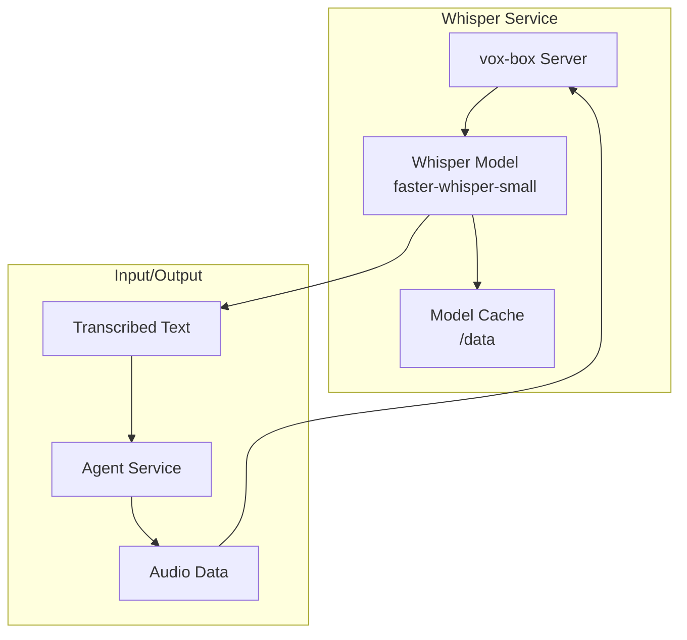

# Whisper STT Service Documentation

This document provides comprehensive documentation for the Whisper Speech-to-Text (STT) service, which handles audio transcription in the Local Voice AI system.

## 📋 Overview

The Whisper service provides speech-to-text functionality using the OpenAI Whisper model through the vox-box containerized service. It transcribes audio input from users into text for processing by the Agent service.

**Technology**: vox-box with Whisper model  
**Model**: Systran/faster-whisper-small  
**Container**: `whisper`  
**Internal Port**: 80  
**External Port**: 11435  
**Data Directory**: `/data` (mounted volume)

## 🏗️ Architecture

### Service Components



### Docker Configuration

```dockerfile
# whisper/Dockerfile
FROM python:3.12-slim-bookworm

RUN apt-get update && \
    apt-get install -y --no-install-recommends \
    build-essential \
    && rm -rf /var/lib/apt/lists/*

RUN pip install --no-cache-dir vox-box

WORKDIR /app

ENV DATA_DIR=/data

CMD ["vox-box", "start", "--huggingface-repo-id", "Systran/faster-whisper-small", "--data-dir", "/data"]
```

### Docker Compose Configuration

```yaml
# docker-compose.yml
whisper:
  build:
    context: ./whisper
  volumes:
    - whisper-data:/data
  ports:
    - "11435:80"
  networks:
    - agent_network
```

## 🔧 Configuration

### Environment Variables

| Variable | Default | Description |
|----------|---------|-------------|
| `DATA_DIR` | `/data` | Directory for model cache and data storage |
| `HUGGINGFACE_REPO_ID` | `Systran/faster-whisper-small` | Hugging Face model repository |

### Model Configuration

- **Model**: `Systran/faster-whisper-small`
- **Language**: Auto-detection (multilingual)
- **Audio Format**: 16kHz, mono, 16-bit PCM
- **Max Duration**: No explicit limit (depends on system resources)

### Volume Configuration

```yaml
volumes:
  whisper-data:
    driver: local
```

The `whisper-data` volume persists:
- Downloaded model files
- Audio cache
- Temporary processing files

## 🔄 API Reference

### OpenAI-Compatible API

The Whisper service exposes an OpenAI-compatible API endpoint for transcription.

#### Transcription Endpoint

```http
POST /v1/transcriptions
Content-Type: multipart/form-data

file: <audio_file>
model: whisper-1
language: en (optional)
response_format: json (optional)
temperature: 0.0 (optional)
```

**Request Parameters**:

| Parameter | Type | Required | Description |
|-----------|------|----------|-------------|
| `file` | File | Yes | Audio file to transcribe |
| `model` | string | Yes | Model identifier (use `whisper-1`) |
| `language` | string | No | Language code (e.g., `en`, `es`) |
| `response_format` | string | No | Response format (`json`, `text`, `srt`, `vtt`) |
| `temperature` | float | No | Sampling temperature (0.0-1.0) |

**Response**:

```json
{
  "text": "Transcribed text here",
  "language": "en",
  "duration": 3.45,
  "words": [
    {
      "word": "Transcribed",
      "start": 0.0,
      "end": 0.8,
      "confidence": 0.95
    }
  ]
}
```

#### Health Check Endpoint

```http
GET /health
```

**Response**:
```json
{
  "status": "healthy",
  "model": "Systran/faster-whisper-small",
  "version": "1.0.0"
}
```

#### Models Endpoint

```http
GET /v1/models
```

**Response**:
```json
{
  "object": "list",
  "data": [
    {
      "id": "whisper-1",
      "object": "model",
      "created": 1234567890,
      "owned_by": "openai"
    }
  ]
}
```

## 🔗 Integration with Agent Service

### Agent Configuration

```python
# agent/myagent.py
stt = openai.STT(
    base_url="http://whisper:80/v1",
    model="whisper-1"
)
```

### Usage Example

```python
async def transcribe_audio(audio_data: bytes) -> str:
    """
    Transcribe audio data using Whisper service.
    
    This function sends audio data to the Whisper service for
    speech-to-text conversion.
    
    Args:
        audio_data: Raw audio bytes in WAV format.
    
    Returns:
        Transcribed text string.
    
    Raises:
        ConnectionError: When Whisper service is unavailable.
        TimeoutError: When transcription takes too long.
    
    See Also:
        docs/services/agent.md: Agent service integration
        docs/architecture.md: System data flow
    """
    try:
        # LiveKit STT plugin handles the API call
        result = await stt.transcribe(audio_data)
        return result.text
    except Exception as e:
        logger.error(f"Whisper transcription failed: {e}")
        raise
```

## 🚀 Deployment and Operations

### Starting the Service

```bash
# Using Docker Compose
docker-compose up whisper

# Manual build and run
cd whisper
docker build -t whisper-stt .
docker run -p 11435:80 -v whisper-data:/data whisper-stt
```

### Service Health Monitoring

```bash
# Check service status
docker-compose ps whisper

# View logs
docker-compose logs -f whisper

# Health check
curl http://localhost:11435/health
```

### Model Management

```bash
# Check downloaded models
docker-compose exec whisper ls -la /data

# Force model re-download
docker-compose down -v
docker-compose up whisper
```

## 🔧 Development Guidelines

### For Coding Agents

When working with the Whisper service:

1. **Audio Format Requirements**: Ensure audio is in correct format (16kHz, mono, 16-bit)
2. **Error Handling**: Implement proper error handling for service unavailability
3. **Timeout Management**: Set appropriate timeouts for transcription requests
4. **Language Detection**: Consider language auto-detection vs. explicit language setting
5. **Performance Monitoring**: Monitor transcription latency and accuracy

### Audio Preprocessing

```python
def preprocess_audio(audio_data: bytes) -> bytes:
    """
    Preprocess audio data for Whisper compatibility.
    
    Whisper expects:
    - 16kHz sample rate
    - Mono channel
    - 16-bit PCM format
    
    Args:
        audio_data: Raw audio data.
    
    Returns:
        Preprocessed audio data in Whisper-compatible format.
    """
    # Convert sample rate if necessary
    # Convert to mono if stereo
    # Convert to 16-bit PCM
    return processed_audio
```

### Error Handling

```python
async def safe_transcribe(audio_data: bytes) -> Optional[str]:
    """
    Safely transcribe audio with fallback handling.
    
    Args:
        audio_data: Audio data to transcribe.
    
    Returns:
        Transcribed text or None if transcription fails.
    """
    try:
        result = await stt.transcribe(audio_data)
        return result.text
    except ConnectionError:
        logger.error("Whisper service unavailable")
        return None
    except TimeoutError:
        logger.error("Whisper transcription timeout")
        return None
    except Exception as e:
        logger.error(f"Unexpected error in transcription: {e}")
        return None
```

## 🚨 Troubleshooting

### Common Issues

#### Service Unavailable
```bash
# Check if service is running
docker-compose ps whisper

# Check network connectivity
docker-compose exec agent ping whisper

# Restart service
docker-compose restart whisper
```

#### Model Download Issues
```bash
# Check model cache
docker-compose exec whisper ls -la /data/models

# Clear cache and re-download
docker-compose down -v
docker-compose up whisper

# Check disk space
df -h
```

#### Audio Format Issues
```bash
# Test with known good audio file
curl -X POST http://localhost:11435/v1/transcriptions \
  -F "file=@test_audio.wav" \
  -F "model=whisper-1"
```

#### Performance Issues
```bash
# Check resource usage
docker stats whisper

# Monitor transcription time
time curl -X POST http://localhost:11435/v1/transcriptions \
  -F "file=@test_audio.wav" \
  -F "model=whisper-1"
```

### Debug Mode

```bash
# Enable debug logging
docker-compose exec whisper vox-box --debug

# Test API directly
curl -v http://localhost:11435/v1/models
```

## 📈 Performance Optimization

### Model Optimization

- **Model Size**: Using `faster-whisper-small` for balance of speed and accuracy
- **Caching**: Persistent volume for model cache to avoid re-downloading
- **Batch Processing**: Process multiple audio segments when possible

### Audio Optimization

```python
# Optimize audio chunk size
OPTIMAL_CHUNK_DURATION = 10  # seconds

def chunk_audio(audio_data: bytes, chunk_duration: int = OPTIMAL_CHUNK_DURATION):
    """
    Split audio into optimal chunks for transcription.
    
    Args:
        audio_data: Raw audio data.
        chunk_duration: Duration of each chunk in seconds.
    
    Yields:
        Audio chunks ready for transcription.
    """
    # Implementation for audio chunking
    pass
```

### Caching Strategy

```python
from functools import lru_cache
import hashlib

@lru_cache(maxsize=100)
def get_cached_transcription(audio_hash: str) -> Optional[str]:
    """
    Cache transcriptions to avoid re-processing identical audio.
    
    Args:
        audio_hash: Hash of audio data for cache key.
    
    Returns:
        Cached transcription or None if not found.
    """
    # Implementation for transcription caching
    pass
```

## 🔍 Testing

### Unit Testing

```python
import pytest
from unittest.mock import AsyncMock, patch

@pytest.mark.asyncio
async def test_whisper_transcription():
    """Test Whisper transcription functionality."""
    # Mock Whisper service
    with patch('livekit.plugins.openai.STT') as mock_stt:
        mock_stt.return_value.transcribe = AsyncMock(
            return_value=MockTranscriptionResult(text="test transcription")
        )
        
        # Test transcription
        stt_service = mock_stt()
        result = await stt_service.transcribe(b"fake_audio")
        
        assert result.text == "test transcription"
```

### Integration Testing

```bash
# Test service health
curl -f http://localhost:11435/health || exit 1

# Test transcription with sample audio
curl -X POST http://localhost:11435/v1/transcriptions \
  -F "file=@test_audio.wav" \
  -F "model=whisper-1" \
  | jq -e '.text' || exit 1
```

### Load Testing

```bash
# Test concurrent requests
for i in {1..10}; do
  curl -X POST http://localhost:11435/v1/transcriptions \
    -F "file=@test_audio.wav" \
    -F "model=whisper-1" &
done
wait
```

## 📊 Monitoring and Metrics

### Performance Metrics

- **Transcription Latency**: Time from audio receipt to text output
- **Accuracy Rate**: Comparison with expected transcriptions
- **Error Rate**: Failed transcription attempts
- **Resource Usage**: CPU and memory consumption

### Logging

```python
# Configure logging for transcription monitoring
import logging

logger = logging.getLogger("whisper_service")

async def transcribe_with_metrics(audio_data: bytes):
    """Transcribe with performance metrics."""
    start_time = time.time()
    
    try:
        result = await stt.transcribe(audio_data)
        duration = time.time() - start_time
        
        logger.info(f"Transcription completed", extra={
            "duration": duration,
            "audio_length": len(audio_data),
            "text_length": len(result.text)
        })
        
        return result
    except Exception as e:
        logger.error(f"Transcription failed", extra={
            "error": str(e),
            "audio_length": len(audio_data)
        })
        raise
```

---

*For Agent service integration, see [docs/services/agent.md](agent.md). For system architecture, see [docs/architecture.md](../architecture.md).*